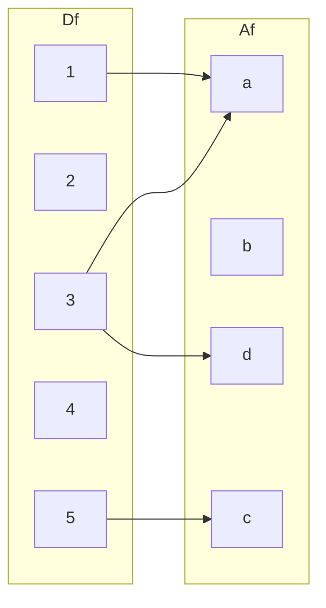
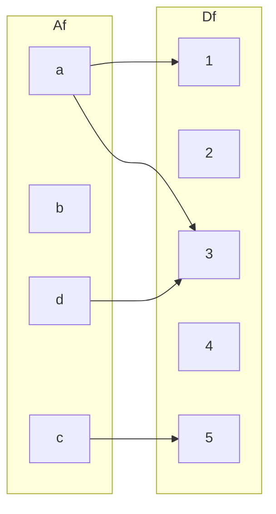
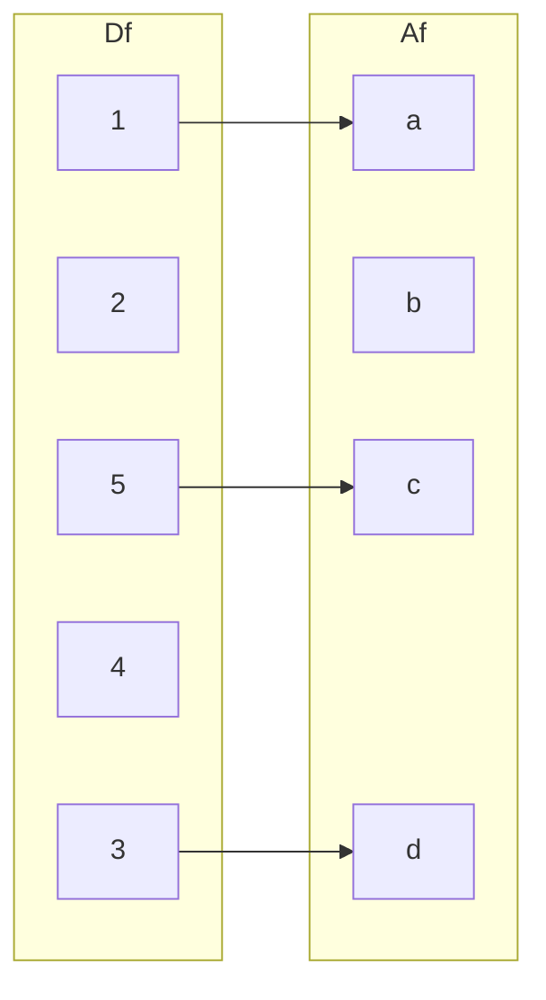
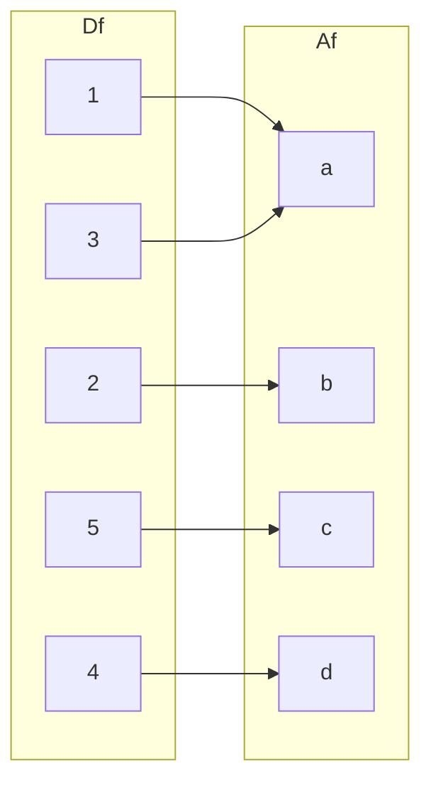

 # 猫猫也能看懂的华一讲义
## 第 2 章　集合（Sets）
### 2.0 引言（节选自原文）

本书以**集合论**为基础，系统介绍**代数**与**分析**的核心理念。

- **康托（Cantor）**提出的集合论是现代数学的基石。  
  在集合论出现之前，数学的发展主要依赖直观和形象化思维；受限于工具，研究的范围相对狭窄——例如，分析学往往只研究具有解析表达式的函数。

- **朴素集合论**把“集合”视为**互不相同的、明确可辨的对象**的总体。  
  然而，**不加限制地把任意对象的总体都当成集合**，会导致**悖论**。  
  最著名的是**罗素悖论**：考虑“所有不包含自身的集合的集合”。如果把它当作一个集合，无论它是否包含自身，都会推出矛盾。

- **公理化集合论**把集合论本身视作一个由**公理系统**支配的结构。  
  这些公理既避免了已知悖论，又保证了数学中所需构造的存在性，从而为整个数学提供了**坚实而可靠的基础**。

---

### 本章目标

- 介绍集合论中最基本的概念与结构，为后续章节做准备。  
- 由于本书并非系统讲授数理逻辑，因此尽量使用**自然语言**而非形式化符号进行说明。
### 2.1 枚举法（Roster notation）

#### 2.1.1 定义  
在朴素集合论（naive set theory）中，

- **集合（set）** 指 **由互不相同的、可明确区分的对象** 组成的一个整体。  
  这些对象称为该集合的 **元素（elements）**。

- **集合相等**：若两个集合 $A,\,B$ 的元素完全相同，则称  
  $$
  A = B.
  $$

- **属于关系**：  
  $$
  a \in A \quad\Longleftrightarrow\quad a\text{ 是 }A\text{ 的一个元素}.
  $$  
  若 $a$ 不属于 $A$，则记作  
  $$
  a \notin A.
  $$  
  此时也称 $a$ **不属于** 集合 $A$。

---

#### 2.1.2 约定  
除非另行说明，本书中提及的 **每一个数学对象** 都默认已经属于 **某个集合**。
* 比如说所有的数都属于一个数集，所有的映射也应该属于一个映射集，诸如此类
#### 2.1.3 枚举记法（Roster Notation）

- **基本写法**  
  把集合的全部元素**按任意顺序、无重复地**列在一对花括号内，例如  
  $$
  \{1,2,3\}.
  $$  
  **顺序与重复不影响集合本身**：  
  $$
  \{1,2,3\} = \{3,2,1\} = \{1,1,2,3\}.
  $$
  * 这和高中的时候不一样，意味着可以任意去写

- **省略号（…）**  
  当元素遵循**明显规律**时，可用省略号：  
  - 有限例子：  
    $$
    \{1,2,\dots,100\},\qquad \{0,1,\dots,n\}.
    $$  
  - 无限例子：  
    $$
    \{\dots,-4,-2,0,2,4,\dots\}.
    $$

- **下标化简写**  
  若对每个指标 $i\in I$ 给定对象 $x_i$，则  
  $$
  \{x_i \mid i\in I\}
  $$  
  表示由这些对象构成的集合；其中 $I$ 称为**指标集**。  
  例如  
  $$
  \{2n \mid n\in\mathbb Z\},\qquad \{2n+1 \mid n\in\mathbb Z\}
  $$  
  分别为所有偶数、所有奇数的集合。
  * 我喜欢把这个叫做函数式写法
### 2.2 子集与幂集（Subsets and Powerset）

#### 2.2.1 定义（子集与真子集）

- **子集**  
  设 $A,B$ 为集合。如果 $A$ 的每一个元素都是 $B$ 的元素，则称  
  $$
  A \subseteq B
  $$  
  （读作 “$A$ 是 $B$ 的子集”），也写作 $B \supseteq A$。

- **真子集**  
  若 $A \subseteq B$ 且 $A \ne B$，则称 $A$ 为 $B$ 的**真子集**，记作  
  $$
  A \subsetneq B \quad\text{或}\quad B \supsetneq A.
  $$

- **术语**  
  若 $A \subseteq B$，也说 “$A$ 被包含在 $B$ 中”，或 “$B$ 包含 $A$”。  
  若 $A \subsetneq B$，则说 “$A$ 被严格包含在 $B$ 中”。

---

#### 2.2.2 注记

- 任何集合都是自身的子集：  
  $$
  A \subseteq A.
  $$

- 若 $A \subseteq B$ 且 $B \subseteq A$，则 $A$ 与 $B$ 元素完全相同，即  
  $$
  A = B.
  $$

---

#### 2.2.3 空集

- **空集**是不含任何元素的集合，记作  
  $$
  \varnothing.
  $$

- **性质**：空集是任何集合的子集：  
  $$
  \forall A,\quad \varnothing \subseteq A.
  $$

---

#### 2.2.4 命题（子集的传递性）

若 $A \subseteq B$ 且 $B \subseteq C$，则  
$$
A \subseteq C.
$$

**证明**  
设 $x \in A$。由 $A \subseteq B$ 得 $x \in B$；再由 $B \subseteq C$ 得 $x \in C$。因此 $A \subseteq C$。  
$\qquad\Box$

---

#### 2.2.5 定义（幂集）

设 $X$ 为一个集合，记  
$$
\mathcal P(X) := \{ A \mid A \subseteq X \}
$$  
为 **$X$ 的幂集**，即 $X$ 的所有子集构成的集合。  
显然  
$$
\varnothing,\ X \in \mathcal P(X).
$$
* 这里写了一条有用的废话。空集和全集X也是子集，当然属于X的幂集啦！不过做题的时候这句话又是有用的，这两个特殊的集合可能要特殊考虑

---

#### 2.2.6 示例

- 空集的幂集：  
  $$
  \mathcal P(\varnothing) = \{\varnothing\}.
  $$

- 单元素集 $\{\varnothing\}$ 的幂集：  
  $$
  \mathcal P\!\bigl(\{\varnothing\}\bigr) = \{\varnothing,\ \{\varnothing\}\}.
  $$
* 这是把一个集合当作更大集合里的元素，要注意这种情况。
### 2.3 描述法（Set-builder Notation）

#### 2.3.1 定义

- **条件（condition）**  
  设 $A$ 是一个集合。如果对每个 $x \in A$ 都指定一个命题 $P(x)$，则称 $P(\cdot)$ 是 **$A$ 上的一个条件**。  
  例：在 $\mathbb Z$ 上，“$x$ 是奇数”就是一个条件。
  * 也就是说，集合（set）上的命题（statement）就是一个条件（contition）

- **描述法**  
  给定集合 $A$ 及其上的条件 $P(\cdot)$，记  
  $$
  \{x \in A \mid P(x)\}
  $$  
  为**满足条件 $P(x)$ 的所有 $x$ 组成的集合**。  
  这是 $A$ 的一个子集，称为 **用条件描述的新集合**。

---

#### 2.3.2 混合记法

有时把 **枚举法** 与 **描述法** 组合使用：

- 设 $I$ 为指标集，对每个 $i \in I$ 给定对象 $r_i$；  
- 设 $P(\cdot)$ 为 $I$ 上的条件，记  
  $$
  \{r_i \mid i \in I,\ P(i)\}
  $$  
  表示 **先过滤指标**（保留使 $P(i)$ 成立的 $i$），再取对应对象 $r_i$ 的集合。
* 这里的$P(i)$可以是任意命题，$I$可以是任意集合

---

#### 2.3.3 示例与警示

- **必须指定“环境集合”**  
  使用构造式记法时，必须固定一个**已知的集合 $A$** 作为“环境”。  
  否则，形如  
  $$
  \{A \mid A \text{ 是集合且 } P(A)\}
  $$  
  的写法 **不一定给出集合**。
   * 我来解释一下这样为什么不行，当使用构造法的时候，我们的$A$类型是一个集合，这个时候理应有一个更大的”集合集“，让我们的$A$成为它的元素。比如说$\{A \in B \mid P(A)\}$.没有更大的集合作为“环境”是不行的！可能导致下面的悖论

- **罗素悖论（Russell’s Paradox）**  
  考虑  
  $$
  \mathcal R = \{A \mid A \text{ 是集合且 } A \notin A\}.
  $$  
  若把 $\mathcal R$ 视为集合，则  
  - $\mathcal R \in \mathcal R$ ⇒ 由定义得 $\mathcal R \notin \mathcal R$；  
  - $\mathcal R \notin \mathcal R$ ⇒ 由定义得 $\mathcal R \in \mathcal R$。  

  两种情形均导致矛盾。因此  
  **“所有集合的集合”不是集合**，同样  
  **“所有不包含自身的集合的集合”也不是集合**。
### 2.4 差集（Set Difference）

#### 2.4.1 定义  
设 $A,\,B$ 为集合。记  
$$
B \setminus A := \{x \in B \mid x \notin A\}
$$  
称为 **$B$ 与 $A$ 的差集**。 
* 这和 **$A$ 与 $B$ 的差集**含义不一样！

若 $A \subseteq B$，则称 $B \setminus A$ 为 **$A$ 在 $B$ 中的补集**（complement of $A$ in $B$）。

---

#### 2.4.2 示例  
设 $A$ 为集合，$P(\cdot)$ 是 $A$ 上的一个条件，则  
$$
\{x \in A \mid \neg P(x)\} = A \setminus \{x \in A \mid P(x)\}.
$$
* 这是因为$A$里面的元素要么让$P(x)$成立，属于右边的集合；要么让$P(x)$的否命题成立，属于左边的集合。A和左边的集合取完差集，剩下的元素自然属于右边的集合。

---

#### 2.4.3 命题  
设 $A,\,B$ 为集合。  
$$
B \setminus A = \varnothing \quad\Longleftrightarrow\quad B \subseteq A.
$$  
特别地，当 $A \subseteq B$ 时  
$$
B \setminus A = \varnothing \quad\Longleftrightarrow\quad A = B.
$$

**证明**  
1. **必要性**：设 $B \setminus A = \varnothing$。任取 $x \in B$，则 $x \notin B \setminus A$，于是 $x \in A$；故 $B \subseteq A$。  
2. **充分性**：设 $B \subseteq A$。若存在 $x \in B \setminus A$，则 $x \in B$ 且 $x \notin A$，与 $B \subseteq A$ 矛盾；故 $B \setminus A = \varnothing$。  

若 $A \subseteq B$，由上述结论立得 $B \setminus A = \varnothing \iff A = B$。  
$\qquad\Box$
* 懒得解释了，huayi是对的
#### 2.4.4 命题（双重差集）

设 $A,\,B$ 为集合，则  
$$
B \setminus (B \setminus A) = \{x \in B \mid x \in A\} = B \cap A.
$$  
特别地，当 $A \subseteq B$ 时，  
$$
B \setminus (B \setminus A) = A.
$$  
进而有  
$$
B \setminus \varnothing = B.
$$

**证明**  
由定义：
$$
B \setminus (B \setminus A) = \{x \in B \mid x \notin B \setminus A\}.
$$

- **$\subseteq$**：任取 $x \in B \setminus (B \setminus A)$，则 $x \in B$ 且 $x \notin B \setminus A$。  
  若 $x \notin A$，则 $x \in B \setminus A$，与 $x \notin B \setminus A$ 矛盾，故 $x \in A$。  
  因此 $x \in B \cap A$。

- **$\supseteq$**：任取 $x \in B \cap A$，则 $x \in B$ 且 $x \in A$。  
  因 $x \in A$，故 $x \notin B \setminus A$，于是 $x \in B \setminus (B \setminus A)$。

综上，得  
$$
B \setminus (B \setminus A) = B \cap A.
$$

若 $A \subseteq B$，则 $B \cap A = A$，故  
$$
B \setminus (B \setminus A) = A.
$$

最后，令 $A = B$，由命题 2.4.3 知 $B \setminus B = \varnothing$，于是  
$$
B \setminus \varnothing = B \setminus (B \setminus B) = B.
$$
$\qquad\Box$

* 这是非常好的书写，同时也揭示了做这一章题的中心思想————取元素！不管你是差集（set difference）还是补集（complement of A in B），只要是等式就可以取元素做，元素如果是也是集合就继续取元素
### 2.5 量词（Quantifiers）

#### 2.5.1 定义

设 $A$ 为一个集合，$P(\cdot)$ 是 $A$ 上的条件（命题函数）。我们使用下列记号：

- **全称量词**  
  $$
  \forall x \in A,\ P(x)
  $$  
  表示命题  
  $$
  \{x \in A \mid P(x)\} = A,
  $$  
  即 **对任意** $x \in A$，$x$ 都满足条件 $P(x)$。  
  日常读作：“对所有 $x \in A$，$P(x)$ 成立。”

- **存在量词**  
  $$
  \exists x \in A,\ P(x)
  $$  
  表示命题  
  $$
  \{x \in A \mid P(x)\} \ne \varnothing,
  $$  
  即 **存在至少一个** $x \in A$，使得 $P(x)$ 成立。  
  日常读作：“存在一个 $x \in A$，使得 $P(x)$ 成立。”

---

#### 2.5.2 示例（空集上的量词）

设 $P(\cdot)$ 是空集 $\varnothing$ 上的**任意条件**。

- 集合  
  $$
  \{x \in \varnothing \mid P(x)\} = \varnothing
  $$  
  是空集，因此  
  - 全称命题  
    $$
    \forall x \in \varnothing,\ P(x)
    $$  
    **恒为真**（空真）
    * 这可以用它的逆否命题（contrapositive）是真命题证明
  - 存在命题  
    $$
    \exists x \in \varnothing,\ P(x)
    $$  
    **恒为假**。
    * 这是因为我们可以考虑满足$P(x)$的所有x的集合。这是一个空集，因此上面的存在命题是假命题
#### 2.5.3 命题（量词对偶律）

设 $A$ 为集合，$P(\cdot)$ 是 $A$ 上的条件。

(1) 下列两个命题互为**真值相反**：
$$
\exists x \in A,\ \neg P(x) \quad\text{与}\quad \forall x \in A,\ P(x).
$$

(2) 下列两个命题也互为**真值相反**：
$$
\forall x \in A,\ \neg P(x) \quad\text{与}\quad \exists x \in A,\ P(x).
$$
* 这些高中都记过，证明方法就是考虑满足P的元素集合，非常类似
* 原来下面有证明，我白白想了一下
---
 证明

(1) 注意到
$$
\{x \in A \mid \neg P(x)\} = A \setminus \{x \in A \mid P(x)\}.
$$
根据命题 2.4.3 的等价结论：
$$
\{x \in A \mid P(x)\} = A
\quad\Longleftrightarrow\quad
\{x \in A \mid \neg P(x)\} = \varnothing.
$$
因此
$$
\exists x \in A,\ \neg P(x)
\quad\text{与}\quad
\forall x \in A,\ P(x)
$$
真值相反。

(2) 将 (1) 中的条件 $P(\cdot)$ 替换为 $\neg P(\cdot)$，得
$$
\forall x \in A,\ \neg P(x)
\quad\text{与}\quad
\exists x \in A,\ \neg\neg P(x)
$$
真值相反。  
又因为对任意 $x \in A$，$\neg\neg P(x)$ 与 $P(x)$ 真值相同，故
$$
\exists x \in A,\ \neg\neg P(x)
\quad\text{与}\quad
\exists x \in A,\ P(x)
$$
真值相同。结论得证。  
$\qquad\Box$
### 2.6 充分条件与必要条件（Sufficient Conditions and Necessary Conditions）

#### 2.6.1 定义

设 $A$ 为集合，$P(\cdot)$ 与 $Q(\cdot)$ 为 $A$ 上的两个条件（Conditions）。

- **充分条件**（Sufficient Conditions）
-   
  若  
  $$
  \{x\in A\mid P(x)\}\subseteq\{x\in A\mid Q(x)\},
  $$  
  则称 **$P(\cdot)$ 是 $Q(\cdot)$ 的充分条件**，同时称 **$Q(\cdot)$ 是 $P(\cdot)$ 的（ Necessary Conditions））。

- **充要条件（等价条件）**（equivalent）
- 
  若  
  $$
  \{x\in A\mid P(x)\}=\{x\in A\mid Q(x)\},
  $$  
  则称 **$P(\cdot)$ 是 $Q(\cdot)$ 的充要条件**，并称 **$P(\cdot)$ 与 $Q(\cdot)$ 等价**。

* 从这里我们可以看到，不少东西都是集合定义的

#### 2.6.2 命题（用逻辑蕴含刻画）

设 $A$ 为集合，$P(\cdot)$ 与 $Q(\cdot)$ 为 $A$ 上的条件。

(1) **充分条件**  
$P(\cdot)$ 是 $Q(\cdot)$ 的充分条件当且仅当  
$$
\forall x\in A,\ P(x)\Rightarrow Q(x).
$$

(2) **必要条件**  
$P(\cdot)$ 是 $Q(\cdot)$ 的必要条件当且仅当  
$$
\forall x\in A,\ Q(x)\Rightarrow P(x).
$$

(3) **充要条件**  
$P(\cdot)$ 是 $Q(\cdot)$ 的充要条件当且仅当  
$$
\forall x\in A,\ P(x)\Leftrightarrow Q(x).
$$

---

证明概要（利用 2.4.3 与 1.5.2）

(1) 由 2.4.3 得  
$$
\bigl(\{x\in A\mid P(x)\}\setminus\{x\in A\mid Q(x)\}\bigr)=\varnothing
\;\Longleftrightarrow\;
\{x\in A\mid P(x)\}\subseteq\{x\in A\mid Q(x)\}.
$$  
又
$$
\{x\in A\mid P(x)\}\setminus\{x\in A\mid Q(x)\}
= \{x\in A\mid P(x)\wedge \neg Q(x)\}
= A\setminus\{x\in A\mid P(x)\to Q(x)\}.
$$  
故
$$
\{x\in A\mid P(x)\to Q(x)\}=A
\;\Longleftrightarrow\;
\forall x\in A,\ P(x)\to Q(x).
$$

(2) 交换 $P(\cdot)$ 与 $Q(\cdot)$，即得结论。  
(3) 结合 (1) 与 (2)，并使用命题 1.5.2 即可。  
$\qquad\Box$
* 帮大家回忆一下还算常用的1.5.2
* 这里用到2.4.3只是因为这里的**充分条件**（Sufficient Conditions）和**必要条件**（ Necessary Conditions）是用子集来定义的，需要转化成差集才好处理
##### 1.5.2 命题（双条件等价于双向蕴含）

###### 设 $P$、$Q$ 为命题，则  
$$
(P \rightarrow Q) \land (Q \rightarrow P) \equiv P \leftrightarrow Q.
$$
##### 2.4.3 命题  
###### 设 $A,\,B$ 为集合。  
$$
B \setminus A = \varnothing \quad\Longleftrightarrow\quad B \subseteq A.
$$  
###### 特别地，当 $A \subseteq B$ 时  
$$
B \setminus A = \varnothing \quad\Longleftrightarrow\quad A = B.
$$
### 2.7 并集（Union）

#### 2.7.1 定义  
设 $I$ 为指标集，对每个 $i\in I$ 给定集合 $A_i$，则称 $(A_i)_{i\in I}$ 为 **以 $I$ 为指标集（parametrised by I）的集合族（a family of sets）**。

- **并集**  
  记  
  $$
  \bigcup_{i\in I} A_i := \Bigl\{x\ \Bigl|\ \exists i\in I,\ x\in A_i\Bigr\},
  $$  
  称为 **所有 $A_i$ 的并集**。  
  按定义，对象 $x$ 属于并集当且仅当 **至少存在一个 $i\in I$** 使得 $x\in A_i$。
  * 这就是一个缩写，$\bigcup_{i\in I} A_i$就是一个集合，表示所有的$A_i$并起来

- **空指标情形**  
  若 $I=\varnothing$，则  
  $$
  \bigcup_{i\in\varnothing} A_i = \varnothing.
  $$
* 这是因为我们任意取元素x，
* 考虑命题“$\exists i \in I,x \in A_i$"
* 它的否命题是$\forall i \in I, x \notin A_i$
* 考虑一下集合会发现否命题是假

#### 2.7.2 简写记号  
对正整数 $n$ 及集合 $A_1,\dots,A_n$，记  
$$
\bigcup_{i=1}^n A_i = A_1\cup A_2\cup\cdots\cup A_n.
$$  
并集结果与 $A_1,\dots,A_n$ 的排列顺序无关。

#### 2.7.3 命题（并集与子集的关系）  
设 $I$ 为指标集，$(A_i)_{i\in I}$ 为集合族，$B$ 为集合。则  
$$
\bigcup_{i\in I} A_i \subseteq B
\quad\Longleftrightarrow\quad
\forall i\in I,\ A_i \subseteq B.
$$
* 我记得昨天还有人问我这个问题为什么是对的...说明大家一定要先看讲义再做题啊

**证明**  
- **必要性**：令 $A = \bigcup_{i\in I} A_i$。对每个 $i\in I$ 都有 $A_i \subseteq A$；若 $A \subseteq B$，则 $A_i \subseteq B$。  
- 另一方面（Conversely），有**充分性**：设对所有 $i\in I$ 成立 $A_i \subseteq B$。任取 $x \in \bigcup_{i\in I} A_i$，则存在 $i\in I$ 使 $x\in A_i$，从而 $x\in B$。因此 $\bigcup_{i\in I} A_i \subseteq B$。  
$\qquad\Box$
* 我觉得必要性是废话。$A_i$不是$\bigcup_{i\in I} A_i$的子集吗？$\bigcup_{i\in I} A_i$又是$B$的子集，所以$A_i$当然是$B$的子集啦
* 充分性还是一样，取元素x秒了
#### 2.7.4 推论
设 $B$ 与 $I$ 为集合。对任意 $i \in I$，令 $P_i(\cdot)$ 为关于 $B$ 的一个条件。则

$$
\{x \in B \mid \exists i \in I,\; P_i(x)\}
= \bigcup_{i \in I} \{x \in B \mid P_i(x)\}.
$$

**证明.** 令

$$
A := \{x \in B \mid \exists i \in I,\; P_i(x)\}, \qquad
A_i := \{x \in B \mid P_i(x)\}, \; (i \in I).
$$

若 $x \in A$，则存在 $j \in I$ 使 $P_j(x)$ 成立，故
$x \in \bigcup_{i \in I} A_i$。  
反之，由定义知对任意 $i \in I$ 有 $A_i \subseteq A$，因此由命题 2.7.3，

$$
\bigcup_{i \in I} A_i \subseteq A.
$$

$\square$

* 这个命题解释完之后也是显然的。它的意思是这样的，B上面有很多条件$P_i$
* 1.然后呢，我们先取出x构成一个集合，要求是x满足有一个$P_i$就行
* 2.我们再分别对每一个$P_i$，我们把满足它的x取出来构成一个小集合
* 3.我们再把小集合作**并集（Union）**
* 4.这样3.产生的**并集（Union）**应该和1.产生的集合是一样的

---

#### 2.7.5 命题
设 $(A_i)_{i \in I}$ 为一族集合，且 $B$ 为一个集合。则

$$
\left(\bigcup_{i \in I} A_i\right) \setminus B
= \bigcup_{i \in I} (A_i \setminus B).
$$
* 我认为这是一个有点抽象的问题
* 要从概念上理解它，首先要理解什么是差集${A \setminus B }$  (the set difference of A and B)
* 我们先把$\bigcup_{i \in I} A_i$叫做A
* ${A \setminus B }$里面的元素都是A里有B里没有的，这样元素形成的集合和每个${A_i \setminus B }$的并集，应该是一样的

**证明.** 记 $A := \bigcup_{i \in I} A_i$。对任意 $i \in I$，有 $A_i \subseteq A$，  
从而

$$
A_i \setminus B \subseteq A \setminus B
\;\;\Longrightarrow\;\;
\bigcup_{i \in I} (A_i \setminus B) \subseteq A \setminus B
$$

（由命题 2.7.3）。  
反之，若 $x \in A \setminus B$，则 $x \in A$ 且 $x \notin B$。由 $x \in A$ 知存在
$i \in I$ 使 $x \in A_i$，于是 $x \in A_i \setminus B$，从而

$$
A \setminus B \subseteq \bigcup_{i \in I} (A_i \setminus B).
$$

两边互含，即得等式成立。 $\square$
### 2.8 交集（intersection）

#### 2.8.1 定义
设 $I$ 是非空集合，且 $(A_i)_{i \in I}$ 是一族以 $I$ 为指标的集合。  
记
$$
\bigcap_{i \in I} A_i
$$
为所有 $A_i$（$i \in I$）的公共元素组成的集合。这个集合称为 $A_i$（$i \in I$）的**交集**。  
注意：若 $i_0$ 是 $I$ 的任意一个元素，则由集合构造符号可得

$$
\{\, x \in A_{i_0} \mid \forall i \in I,\; x \in A_i \,\}
$$

是一个集合。这个集合就是 $(A_i)_{i \in I}$ 的交集。

根据定义，一个数学对象 $x$ 属于 $\bigcap_{i \in I} A_i$ 当且仅当

$$
\forall i \in I,\; x \in A_i.
$$
* 和**并集（union）** 非常类似
---

#### 2.8.2 记号
设 $n$ 是正整数（let n be a positive integer），且 $A_1, \dots, A_n$ 是集合。我们记

$$
\bigcap_{i \in \{1, \dots, n\}} A_i
= A_1 \cap \cdots \cap A_n.
$$

注意这个记号与 $A_1, \dots, A_n$ 的排列顺序无关。  
特别地，若 $A$ 和 $B$ 是两个集合，则

$$
\{\, x \in B \mid x \in A \,\} = B \cap A.
$$

因此，命题 2.4.4 的第一条陈述可以写作：

对于任意集合 $A$ 与 $B$，都有
$$
B \setminus (B \setminus A) = B \cap A.
$$

---

#### 2.8.3 注记
在集合论中，考虑空集合族的交集是没有意义的。事实上，若这样的交集作为一个集合存在，则对任意数学对象 $x$，由于命题

$$
\forall i \in \varnothing,\; x \in A_i
$$

总是真命题（参见例 2.5.2），我们将得到 $x$ 属于 $\bigcap_{i \in \varnothing} A_i$。  
根据罗素悖论，这是不可能的。
* 这里可能要解释一下。
* 它的意思是，我们对一个集合族取交集的时候，如果集合族里面没有集合，这个操作没有什么意义
* 因为我们任意取一个元素x，它总是在这个“空”集合族的”交“里面
#### 2.8.4 命题（交集与子集的关系）

设 $I$ 为非空指标集，$(A_i)_{i\in I}$ 为一族集合，$B$ 为集合。则  
$$
B \subseteq \bigcap_{i\in I} A_i
\quad\Longleftrightarrow\quad
\forall i\in I,\ B \subseteq A_i.
$$

**证明**  
- **$\Rightarrow$**：设 $B \subseteq \bigcap_{i\in I}A_i$。任取 $x\in B$，则 $x\in\bigcap_{i\in I}A_i$，于是对任意 $i\in I$ 均有 $x\in A_i$；故 $B\subseteq A_i$。  
- **$\Leftarrow$**：设对所有 $i\in I$ 有 $B\subseteq A_i$。任取 $x\in B$，则对每个 $i$ 都有 $x\in A_i$，于是 $x\in\bigcap_{i\in I}A_i$；故 $B\subseteq\bigcap_{i\in I}A_i$。  
$\qquad\Box$
* 和2.7.5的证明方法非常类似，可以对照着看

---

#### 2.8.5 推论（交集的构造式表示）

设 $B$ 为集合，$I$ 为非空指标集，对每个 $i\in I$ 给定条件 $P_i(\cdot)$ 于 $B$ 上，则 

  $\{x\in B\mid\forall i\in I,\ P_i(x)\}=\bigcap_{i\in I}\{x\in B\mid P_i(x)\}.$

**证明**  
- 令  
  $A:=\{x\in B\mid\forall i\in I,\ P_i(x)\},\quad
  A_i:=\{x\in B\mid P_i(x)\}.$  
- 若 $x\in A$，则对每个 $i$ 都有 $P_i(x)$ 为真，故 $x\in A_i$ 对所有 $i$ 成立，于是 $x\in\bigcap_{i\in I}A_i$。  
- 反之，若 $x\in\bigcap_{i\in I}A_i$，则对每个 $i$ 都有 $x\in A_i$，即 $P_i(x)$ 为真，于是 $x\in A$。  
$\qquad\Box$
* 和2.7.4 很像
#### 2.8.6 命题（交集对差集的分配律）

设 $B$ 为集合，$(A_i)_{i\in I}$ 为一族集合，则  
$\Bigl(\bigcap_{i\in I} A_i\Bigr) \setminus B=\bigcap_{i\in I}(A_i \setminus B).$
* 都差不多

**证明**  
令 $A := \bigcap_{i\in I} A_i$。  
- 对任意 $i\in I$ 有 $A \subseteq A_i$，因此  
  $$
  A \setminus B \subseteq A_i \setminus B.
  $$  
  由命题 2.8.4 得  
  $$
  A \setminus B \subseteq \bigcap_{i\in I}(A_i \setminus B).
  $$

- 反之，若 $x \in \bigcap_{i\in I}(A_i \setminus B)$，则对每个 $i\in I$ 都有  
  $x \in A_i$ 且 $x \notin B$；于是  
  $x \in \bigcap_{i\in I} A_i$ 且 $x \notin B$，即  
  $x \in A \setminus B$。

综上，等式成立。  
$\qquad\Box$
#### 2.8.7 命题（并与交对集合运算的分配律）

设 $I$ 为指标集，$(A_i)_{i\in I}$ 为一族集合，$B$ 为任意集合。以下四条恒等式成立：

| 序号 | 恒等式（对所有情形成立，除非额外注明） |
|------|------------------------------------------|
| (1) | $B \cap \displaystyle\bigcup_{i\in I} A_i = \bigcup_{i\in I}(B \cap A_i)$ |
| (2) | 若 $I \ne \varnothing$，则 $B \cup \displaystyle\bigcap_{i\in I} A_i = \bigcap_{i\in I}(B \cup A_i)$ |
| (3) | 若 $I \ne \varnothing$，则 $B \setminus \displaystyle\bigcup_{i\in I} A_i = \bigcap_{i\in I}(B \setminus A_i)$ |
| (4) | 若 $I \ne \varnothing$，则 $B \setminus \displaystyle\bigcap_{i\in I} A_i = \bigcup_{i\in I}(B \setminus A_i)$ |

---

#### 证明

**(1) 交对并的分配律**  
由推论 2.8.5 得  
$$
\begin{aligned}
B \cap \bigcup_{i\in I} A_i
&= \bigl\{x\in B \mid \exists i\in I,\ x\in A_i\bigr\} \\
&= \bigcup_{i\in I}\bigl\{x\in B \mid x\in A_i\bigr\} \\
&= \bigcup_{i\in I}(B \cap A_i).
\end{aligned}
$$

**(2) 并对交的分配律**  
- 设 $x \in B \cup \bigcap_{i\in I} A_i$，则  
  - 若 $x\in B$，则对所有 $i$ 均有 $x\in B\cup A_i$；  
  - 若 $x\in \bigcap_{i\in I} A_i$，则对所有 $i$ 均有 $x\in A_i\subseteq B\cup A_i$。  
  故 $x\in \bigcap_{i\in I}(B\cup A_i)$。  

- 设 $x\in \bigcap_{i\in I}(B\cup A_i)$，则对每个 $i$ 有 $x\in B$ 或 $x\in A_i$。  
  若 $x\notin B$，则必 $x\in A_i$ 对所有 $i$ 成立，故 $x\in \bigcap_{i\in I} A_i$；  
  从而 $x\in B\cup \bigcap_{i\in I} A_i$。  

**(3) 差集对并的分配律**  
由命题 2.5.3 得  
$$
\begin{aligned}
B \setminus \bigcup_{i\in I} A_i
&= \bigl\{x\in B \mid \neg(\exists i\in I,\ x\in A_i)\bigr\} \\
&= \bigl\{x\in B \mid \forall i\in I,\ x\notin A_i\bigr\} \\
&= \bigcap_{i\in I}(B \setminus A_i).
\end{aligned}
$$

**(4) 差集对交的分配律**  
由命题 2.5.3 得  
$$
\begin{aligned}
B \setminus \bigcap_{i\in I} A_i
&= \bigl\{x\in B \mid \neg(\forall i\in I,\ x\in A_i)\bigr\} \\
&= \bigl\{x\in B \mid \exists i\in I,\ x\notin A_i\bigr\} \\
&= \bigcup_{i\in I}(B \setminus A_i).
\end{aligned}
$$

$\qquad\Box$

* 这四条我不想解释了，不理解的话取出x左右互相推一下就好了
### 2.9 笛卡尔积
#### 2.9.1 定义
已知$A$和$B$是两个集合，我们把下面的集合叫做$A$和$B$的**笛卡尔积（Cartesian Product）**：
$$\{(x,y) \mid x \in A,y \in B\}\text{,}$$
记作$A \times B$。
更一般地，给出若干集合$A_1\text{，}...\text{，}A_n$，类似地定义它们的笛卡尔积：
$$\{(x_1,...,x_n) \mid x_1 \in A_1,...,x_n \in A_n\}\text{，}$$
并记作$A_1 \times ... \times A_n$。
下面的命题揭示了**二元有序组（Ordered Pair）** 可以通过集合论来构造。
* 一个多元数组可以定义为一个有序的元素集合
#### 2.9.2 命题
已知元素$x\text{，}y\text{，}x' \text{和}y'$,则等式
$$\{\{x\},\{x,y\}\}=\{\{x'\},\{x',y'\}\}$$
成立的充要条件为$x=x' \text{且}y=y'$。
**证明**
必要性显然。
充分性：
当等式成立时，假设$x \neq x'$，那么$\{x\} \neq \{x'\}$，进而只能有$\{x\}=\{x',y'\}$，要使这个等式成立，必定会有$x=x'$，矛盾。
假设$y \neq y'$，那么$\{x,y\} \neq \{x',y'\}$（除非$y=x'$且$x=y'$，但是上面已经证明$x=x'$，这会导致$y=y'$，矛盾）。因此，只能是$\{x,y\}=\{x'\}$且$\{x',y'\}=\{x\}$，这又会导致$y=x'$且$x=y'$，同上一段证明，矛盾。
综上所述，充分性成立。
# 第 3 章 对应（correspondence）

### 3.1对应（correspondence）和对应的逆（inverse）

#### 3.1.1 定义 
我们将拥有如下形式的三元组称之为对应
$$
f=(𝒟_f,𝒜_f,ℾ_f)
$$
其中 $𝒟_f$ 与 $𝒜_f$ 为两个集合，称之为 $f$ 的起始集与目标集，$ℾ_f$ 是 $𝒟_f \times 𝒜_f$ 的子集，称之为f的像
如果 $X$ 和 $Y$ 是两个集合， $f$是一个形如 $(X,Y,ℾ_f)$ 的对应，我们称之 $f$为从 $X$到 $Y$的对应
* 也就是说起始集$𝒟_f$，目标集$𝒜_f$，和具体对应关系$ℾ_f$是一个对应的三要素

#### 3.1.2 定义  
设 $f$ 为一个对应（correspondence）。我们用 $f^{-1}$ 表示如下定义的对应：  

$$
\begin{aligned}
\mathscr{D}_{f^{-1}} &:= \mathscr{R}_f, \\[4pt]
\mathscr{R}_{f^{-1}} &:= \mathscr{D}_f,
\end{aligned}
$$
（disjunction）
且

$$
f^{-1} := \{\,(y,x)\in\mathscr{R}_f\times\mathscr{D}_f \mid (x,y)\in f\,\}.
$$

称对应 $f^{-1}$ 为 $f$ 的**逆对应**（inverse correspondence）。显然有  

$$
(f^{-1})^{-1}=f,
$$

即 $f$ 是 $f^{-1}$ 的逆对应（inverse correspondence）。
* 就是把正向箭头改成反向箭头，很好理解吧

#### 3.1.3 例子  
设 $X$ 是一个集合。把下列 $X\times X$ 的子集记作 $\Delta_x$：  

$$
\Delta_x := \{\,z\in X\times X \mid \exists a\in X,\ z=(a,a)\,\},
$$

称之为 $X\times X$ 的**对角子集（diagonal subset）**。对应 $(X,X,\Delta_x)$ 称为 $X$ 的**恒等对应（identity correspondence）**，记作 $\operatorname{Id}_X$。由定义可知  

$$
(\operatorname{Id}_X)^{-1}=\operatorname{Id}_X.
$$
* 就是在X这个域上满足定义域和值域都是X,f（x）=x的一类映射
* 对角子集的名字源于：如果画一个表，那么只有对角线上的元素在这个集合里
* 可以参考3.2.2的画图方法

#### 3.1.4 例子  
设 $X,Y$ 为两个集合。存在一个从 $X$ 到 $Y$ 的对应，其**图（graph）** 为空集。该对应称为从 $X$ 到 $Y$ 的**空对应（empty correspondence）**。注意，从 $X$ 到 $Y$ 的空对应的**逆对应（inverse correspondence）** 就是从 $Y$ 到 $X$ 的空对应。
* 就是对于所有的x，f（x）都不存在

### 3.2对应的可视化与表示方法

#### 3.2.1 注记（Remark）
一个对应（correspondence）可以看作是一个有向图（oriented graph）。$\mathscr{D}_f$ 和 $\mathscr{A}_f$ 的元素由两组顶点（vertices）表示。对于图 $\Gamma_f$ 中的任何有序对（ordered pair），我们通过一个箭头（arrow）连接相应的顶点。在下面的图中，我们展示了从 $\{1, 2, 3, 4, 5\}$ 到 $\{a, b, c, d\}$ 的一个对应（correspondence）。

图 3.1：对应（correspondence）$f$ 的可视化  

逆对应（inverse correspondence）$f^{-1}$ 可通过将上图中的箭头方向反转来可视化。

图 3.2：逆对应（inverse correspondence）$f^{-1}$ 的可视化

#### 3.2.2 注记（Remark）

我们也可以用**表格（table）**来表示一个对应（correspondence）$f$：
- 用**行（rows）**标注 $f$ 的**定义域（domain）** $\mathscr{D}_f$ 中的元素；
- 用**列（columns）**标注 $f$ 的**值域（range）** $\mathscr{R}_f$ 中的元素。

对于每一对 $(x, y) \in f$，在对应坐标处的单元格内标记符号 “✓”。例如，图 3.3 描述的对应（correspondence）可以通过下表表示。

表 3.1：对应（correspondence）$f$ 的表格表示

|   | a | b | c | d |
|---|---|---|---|---|
| 1 | ✓ |   |   |   |
| 2 |   |   |   |   |
| 3 | ✓ |   | ✓ |   |
| 4 |   |   |   |   |
| 5 |   | ✓ | ✓ |   |

其逆对应（inverse correspondence）可以通过转置表表示。

表 3.2：逆对应（inverse correspondence）$f^{-1}$ 的表格表示

|   | 1 | 2 | 3 | 4 | 5 |
|---|---|---|---|---|---|
| a | ✓ |   | ✓ |   |   |
| b |   |   |   |   | ✓ |
| c |   |   |   |   | ✓ |
| d |   |   |   | ✓ |   |

#### 3.2.3 注记（Remark）
从 $\mathbb{R}$ 到 $\mathbb{R}$ 的对应（correspondence）可以通过其在坐标平面（coordinate plane）中的图（graph）来表示。例如，考虑这样一个对应 $f$，其中
$$
\Gamma_f := \{(x, y) \in \mathbb{R} \times \mathbb{R} \mid x = y^2\}.
$$
其函数图像是平凡的

### 3.3 图像（Image）和原像（Preimage）

#### 3.3.1 定义
设 $X$ 和 $Y$ 是集合，$f$ 是从 $X$ 到 $Y$ 的一个对应（correspondence）。如果 $(x, y)$ 是 $\Gamma_f$ 的一个元素，我们说 $x$ 是 $y$ 在 $f$ 下的**原像（preimage）**，$y$ 是 $x$ 在 $f$ 下的**图像（image）**。

如果 $A$ 是一个集合，我们用 $f(A)$ 表示集合
$$
\{y \in \mathscr{A}_f \mid \exists x \in A \text{ 使得 } (x, y) \in \Gamma_f\},
$$
称为 $A$ 在对应 $f$ 下的**图像（image）**。

如果 $B$ 是一个集合，集合 $f^{-1}(B)$ 称为 $B$ 在对应 $f$ 下的**原像（preimage）**。注意，根据定义，它是由逆对应（inverse correspondence）$f^{-1}$ 得到的 $B$ 的图像（image）。

#### 3.3.2 定义
设 $f$ 是一个对应。集合 $f(\mathscr{D}_f)$ 称为 $f$ 的**值域（range）**，记作 $\text{Im}(f)$。集合 $f^{-1}(\mathscr{R}_f)$ 称为 $f$ 的**定义域（domain）**，记作 $\text{Dom}(f)$。注意，对应 $f$ 的定义域是图 $\Gamma_f$ 到出发集 $\mathscr{D}_f$ 的投影，而对应 $f$ 的值域是图 $\Gamma_f$ 到到达集 $\mathscr{A}_f$ 的投影。

对于任何集合 $A$ 和 $B$，
$$
f(A) \subseteq \text{Im}(f), \quad f^{-1}(B) \subseteq \text{Dom}(f).
$$

此外，
$$
\text{Dom}(f) = \text{Im}(f^{-1}), \quad \text{Im}(f) = \text{Dom}(f^{-1}).
$$

#### 3.3.3 例子
下图展示了一个从 $\mathbb{R}$ 到 $\mathbb{R}$ 的对应，其图像为
$$
\{(x, y) \in \mathbb{R}^2 \mid x^2 + y^2 \leq 1\}.
$$

图像略

#### 3.3.4 命题（Proposition）
设 $f$ 是一个对应（correspondence）。

(1) 如果 $A$ 和 $A'$ 是两个集合，使得 $A' \subseteq A$，那么 $f(A') \subseteq f(A)$。

(2) 如果 $B$ 和 $B'$ 是两个集合，使得 $B \subseteq B'$，那么 $f^{-1}(B) \subseteq f^{-1}(B')$。

**证明（Proof）**：只需证明第一个陈述。设 $y$ 是 $f(A')$ 的一个元素。根据定义，存在 $x \in A'$ 使得 $(x, y) \in \Gamma_f$。由于 $A' \subseteq A$，我们有 $x \in A$ 因此 $y \in f(A)$。 $\blacksquare$
* * 定义域$A'$被定义域$A$包含了，相应的，值域也应被包含

#### 3.3.5 命题（Proposition）
设 $f$ 是一个对应（correspondence）。以下等式成立：
$$
\text{Im}(f) = f(\text{Dom}(f)), \quad \text{Dom}(f) = f^{-1}(\text{Im}(f)).
$$

* $\text{Im}(f)$是f的值域
* f(A)的意思是当起始集被限制在A上时，f此时的值域，其中A应当是一个集合
* $\text{Dom}(f)$是f的定义域，里面的元素是让f(x)有意义的元素
* 所以命题的意思是，把起始集被限制在定义域上后，对应的值域不变。
* 这是当然的，因为定义域之外的元素不会有相应的对应，当然不会产生更多的值域里的元素
**证明（Proof）**：由于 $\text{Dom}(f) \subseteq \mathscr{D}_f$，根据命题 3.3.4，我们有
$$
f(\text{Dom}(f)) \subseteq f(\mathscr{D}_f) = \text{Im}(f).
$$

设 $y$ 是 $\text{Im}(f)$ 的一个元素。存在 $x \in \mathscr{D}_f$ 使得 $(x, y) \in \Gamma_f$。根据定义，我们有 $x \in \text{Dom}(f)$ 因此 $y \in f(\text{Dom}(f))$。因此等式 $\text{Im}(f) = f(\text{Dom}(f))$ 成立。将此等式应用于 $f^{-1}$，我们得到第二个等式。 $\blacksquare$

#### 3.3.6 命题（Proposition）
设 $f$ 是一个对应（correspondence）。

(1) 设 $A$ 是一个集合，$y$ 是一个数学对象（mathematical object）。则 $y$ 属于 $f(A)$ 当且仅当 $A \cap f^{-1}(\{y\}) \neq \emptyset$。

(2) 设 $B$ 是一个集合，$x$ 是一个数学对象。则 $x$ 属于 $f^{-1}(B)$ 当且仅当 $B \cap f(\{x\}) \neq \emptyset$。

* （1）的意思是”y在值域里“和“有一个x，它的对应是y”这两个命题是等价的
* （2）的意思是”x在定义域里“和“有一个y，它是x对应过来的”这两个命题是等价的

**证明（Proof）** (1) 根据定义，$y \in f(A)$ 当且仅当存在 $x \in A$ 使得 $(x, y) \in \Gamma_f$，或者等价地 $x \in A \cap f^{-1}(\{y\})$。应用 (1) 到 $f^{-1}$，我们得到 (2)。 $\blacksquare$

#### 3.3.7 命题（Proposition）
设 $f$ 是一个对应（correspondence）。

(1) 设 $I$ 是一个集合，$(A_i)_{i \in I}$ 是由 $I$ 参数化的集合族。则等式
$$
f\left(\bigcup_{i \in I} A_i\right) = \bigcup_{i \in I} f(A_i)
$$
成立。此外，如果 $I$ 不为空，则
$$
f\left(\bigcap_{i \in I} A_i\right) \subseteq \bigcap_{i \in I} f(A_i)
$$

(2) 设 $I$ 是一个集合，$(B_i)_{i \in I}$ 是由 $I$ 参数化的集合族。则等式
$$
f^{-1}\left(\bigcup_{i \in I} B_i\right) = \bigcup_{i \in I} f^{-1}(B_i)
$$
成立。此外，如果 $I$ 不为空，则
$$
f^{-1}\left(\bigcap_{i \in I} B_i\right) \subseteq \bigcap_{i \in I} f^{-1}(B_i).
$$

**证明（Proof）** (1) 根据命题 3.3.6 和 2.8.7，我们得到
$$
\begin{aligned}
f\left(\bigcup_{i \in I} A_i\right) &= \left\{y \in Y \mid \left(\bigcup_{i \in I} A_i\right) \cap f^{-1}(\{y\}) \neq \emptyset\right\} \\
&= \left\{y \in Y \mid \bigcup_{i \in I} (A_i \cap f^{-1}(\{y\})) \neq \emptyset\right\} \\
&= \left\{y \in Y \mid \exists i \in I,\ A_i \cap f^{-1}(\{y\}) \neq \emptyset\right\} \\
&= \bigcup_{i \in I} f(A_i),
\end{aligned}
$$
并且
$$
\begin{aligned}
f\left(\bigcap_{i \in I} A_i\right) &= \left\{y \in Y \mid \left(\bigcap_{i \in I} A_i\right) \cap f^{-1}(\{y\}) \neq \emptyset\right\} \\
&\subseteq \left\{y \in Y \mid \forall i \in I,\ A_i \cap f^{-1}(\{y\}) \neq \emptyset\right\} \\
&= \bigcap_{i \in I} f(A_i).
\end{aligned}
$$
应用 (1) 到 $f^{-1}$，我们得到 (2)。 $\blacksquare$

* 在没有说f的性质的情况下，f和$f^{-1}$应该有一样的性质，所以只需要做第一问
* 如果你认真阅读了chapter2，第一条式子你会觉得熟悉
* 如果一个元素在每个$A_i$里面都存在，它的对应才会存在于左边的集合
* 在这个时候它的对应也存在于每一个$f(A_i)$里，取交集后，它的对应也一定存在于右边的集合
* 第二条式子不取等的原因是可能有一对多，你们可以试着构造一下

### 3.4 复合（Composition）

#### 3.4.1 定义（Definition）
设 $f$ 和 $g$ 是对应（correspondences）。我们定义 $g$ 和 $f$ 的复合（composition）$g \circ f$ 从 $\mathscr{D}_f$ 到 $\mathscr{A}_g$，其图（graph）$\Gamma_{g \circ f}$ 由满足以下条件的元素 $(r, z)$ 组成：存在某个对象 $y$ 满足 $(r, y) \in \Gamma_f$ 且 $(y, z) \in \Gamma_g$。换句话说，

$$
\Gamma_{g \circ f} = \{(r, z) \in \mathscr{D}_f \times \mathscr{A}_g \mid \exists y \in \mathscr{A}_f \cap \mathscr{D}_g, (r, y) \in \Gamma_f \text{ 且 } (y, z) \in \Gamma_g\}.
$$

#### 3.4.2 命题（Proposition）
设 $f$ 和 $g$ 是对应（correspondences）。以下等式成立：

$$
(g \circ f)^{-1} = f^{-1} \circ g^{-1}.
$$

**证明（Proof）**：设 $x \in \mathscr{A}_{f^{-1}} = \mathscr{D}_g$，$z \in \mathscr{D}_{g^{-1}} = \mathscr{A}_g$。则 $(z, x) \in \Gamma_{(g \circ f)^{-1}}$ 当且仅当 $(x, z) \in \Gamma_{g \circ f}$，即存在 $y$ 使得 $(x, y) \in \Gamma_f$ 且 $(y, z) \in \Gamma_g$。这也等价于存在 $y$ 使得 $(z, y) \in \Gamma_{g^{-1}}$ 且 $(y, x) \in \Gamma_{f^{-1}}$，即 $(z, x) \in \Gamma_{f^{-1} \circ g^{-1}}$。 $\blacksquare$

#### 3.4.3 命题（Proposition）
设 $f$，$g$ 和 $h$ 是对应（correspondences）。以下等式成立：

$$
h \circ (g \circ f) = (h \circ g) \circ f.
$$

**证明（Proof）**：只需验证 $h \circ (g \circ f)$ 和 $(h \circ g) \circ f$ 的图（graph）相同。根据定义，元素 $(x, w) \in \mathscr{D}_f \times \mathscr{A}_h$ 属于 $h \circ (g \circ f)$ 的图当且仅当存在 $z$ 使得 $(x, z) \in \Gamma_{g \circ f}$ 且 $(z, w) \in \Gamma_h$，这等价于存在 $y$ 和 $z$ 使得 $(x, y) \in \Gamma_f$，$(y, z) \in \Gamma_g$ 且 $(z, w) \in \Gamma_h$。类似的论证表明，这个条件也等价于 $(x, w) \in \Gamma_{(h \circ g) \circ f}$。因此等式 (3.3) 成立。 $\blacksquare$

#### 3.4.4 命题（Proposition）
设 $X$ 和 $Y$ 是集合，$f$ 是从 $X$ 到 $Y$ 的一个对应（correspondence）。则以下等式成立：

$$
f \circ \operatorname{Id}_X = f = \operatorname{Id}_Y \circ f.
$$

**证明（Proof）**：设 $(x, y) \in X \times Y$。根据定义，$(x, y)$ 属于 $\operatorname{Id}_X$ 的图当且仅当存在 $x'$ 使得 $(x, x') \in \Delta_X$ 且 $(x', y) \in \Gamma_f$，即 $x = x'$ 且 $(x, y) \in \Gamma_f$。因此 $f \circ \operatorname{Id}_X = f$。应用这个等式到 $f^{-1}$，我们得到 $f^{-1} \circ \operatorname{Id}_Y = f^{-1}$。

取逆对应（inverse correspondences），由 (3.1) 和 (3.2) 我们推导出

$$
\operatorname{Id}_Y \circ f = f.
$$ $\blacksquare$

### 3.4.5 命题（Proposition）

设 $f$ 和 $g$ 是对应（correspondences）。

(1) 对于任意集合 $A$，有
$$
(g \circ f)(A) = g(f(A)).
$$

特别地，
$$
\text{Im}(g \circ f) = g(\text{Im}(f)) \subseteq \text{Im}(g).
$$
如果此外 $\text{Dom}(g) \subseteq \text{Im}(f)$，则等式 $\text{Im}(g \circ f) = \text{Im}(g)$ 成立。

(2) 对于任意集合 $B$，有
$$
(g \circ f)^{-1}(B) = f^{-1}(g^{-1}(B)).
$$

特别地，
$$
\text{Dom}(g \circ f) = f^{-1}(\text{Dom}(g)) \subseteq \text{Dom}(f).
$$
如果此外 $\text{Im}(f) \subseteq \text{Dom}(g)$，则等式 $\text{Dom}(g \circ f) = \text{Dom}(f)$ 成立。

**证明（Proof）** (1) 根据定义，
$$
\begin{aligned}
(g \circ f)(A) &= \{z \in \mathscr{A}_g \mid \exists x \in A, (x, z) \in \Gamma_{g \circ f}\} \\
&= \{z \in \mathscr{A}_g \mid \exists x \in A, \exists y \in \mathscr{A}_f, (x, y) \in \Gamma_f, (y, z) \in \Gamma_g\} \\
&= \{z \in \mathscr{A}_g \mid \exists y \in f(A), (y, z) \in \Gamma_g\} = g(f(A)).
\end{aligned}
$$

将此等式应用于 $A = \mathscr{D}_f$，我们得到
$$
\text{Im}(g \circ f) = (g \circ f)(\mathscr{D}_f) = g(f(\mathscr{D}_f)) = g(\text{Im}(f)) \subseteq \text{Im}(g).
$$

在 $\text{Im}(g) \subseteq \text{Dom}(f)$ 的情况下，根据命题 3.3.5 和 3.3.4 我们得到
$$
\text{Im}(g) = g(\text{Dom}(g)) \subseteq g(\text{Im}(f)) = \text{Im}(g \circ f).
$$

因此等式 $\text{Im}(g \circ f) = \text{Im}(g)$ 成立。应用 (1) 到 $g^{-1}$ 和 $f^{-1}$，通过 (3.2) 我们得到 (2)。 $\blacksquare$

### 3.5 满射性（Surjectivity）

#### 3.5.1 定义（Definition）
设 $f$ 是一个对应（correspondence）。如果 $\mathscr{A}_f = \text{Im}(f)$，我们说 $f$ 是**满射（surjective）**。如果 $f^{-1}$ 是满射，或者等价地 $\text{Dom}(f) = \mathscr{D}_f$，我们说 $f$ 是**多值映射（multivalued mapping）**。

#### 3.5.2 命题（Proposition）
设 $f$ 是一个对应（correspondence）。

(1) 假设 $f$ 是满射（surjective）。那么，对于 $\mathscr{A}_f$ 的任意子集 $B$，有 $B \subseteq f(f^{-1}(B))$。

(2) 假设 $f$ 是多值映射（multivalued mapping）。那么，对于 $\mathscr{D}_f$ 的任意子集 $A$，有 $A \subseteq f^{-1}(f(A))$。

**证明（Proof）** (1) 设 $y$ 是 $B$ 的一个元素。由于 $f$ 是满射，存在 $x \in \mathscr{D}_f$ 使得 $(x, y) \in \Gamma_f$。因此，$x \in f^{-1}(B)$ 从而 $y \in f(f^{-1}(B))$。

将 (1) 应用于 $f^{-1}$，我们得到 (2)。 $\blacksquare$

#### 3.5.3 命题（Proposition）
设 $f$ 和 $g$ 是对应（correspondences）。

(1) 如果 $g \circ f$ 是满射（surjective），那么 $g$ 也是满射。

(2) 如果 $g \circ f$ 是多值映射（multivalued mapping），那么 $f$ 也是多值映射。

**证明（Proof）** (1) 根据命题 3.4.5 的 (1)，有
$$
\text{Im}(g \circ f) \subseteq \text{Im}(g) \subseteq \mathscr{A}_g = \mathscr{A}_{g \circ f}.
$$
如果 $g \circ f$ 是满射，即 $\text{Im}(g \circ f) = \mathscr{A}_{g \circ f}$，那么我们从 (3.4) 推导出 $\text{Im}(g) = \mathscr{A}_g$，即 $g$ 是满射。将 (1) 应用于 $g^{-1}$ 和 $f^{-1}$，我们得到 (2)。 $\blacksquare$

#### 3.5.4 命题（Proposition）
设 $f$ 和 $g$ 是对应（correspondences）。

(1) 如果 $g$ 是满射且 $\text{Dom}(g) \subseteq \text{Im}(f)$，那么 $g \circ f$ 也是满射。

(2) 如果 $f$ 是多值映射且 $\text{Im}(f) \subseteq \text{Dom}(g)$，那么 $g \circ f$ 也是多值映射。

**证明（Proof）** (1) 由于 $\text{Dom}(g) \subseteq \text{Im}(f)$，根据命题 3.4.5 的 (1) 我们得到
$$
\text{Im}(g \circ f) = \text{Im}(g).
$$
由于 $g$ 是满射，
$$
\text{Im}(g) = \mathscr{A}_g = \mathscr{A}_{g \circ f}.
$$
因此 $g \circ f$ 也是满射。将 (1) 应用于 $g^{-1}$ 和 $f^{-1}$，我们得到 (2)。 $\blacksquare$

### 3.6 单射性（Injectivity）

#### 3.6.1 定义（Definition）
设 $f$ 是一个对应（correspondence）。如果 $\mathscr{D}_f$ 的每个元素在 $f$ 下最多有一个图像（image），我们说 $f$ 是一个函数（function）。如果 $f^{-1}$ 是一个函数，或者等价地，$\mathscr{A}_f$ 的每个元素在 $f$ 下最多有一个原像（preimage），我们说 $f$ 是单射（injective）。

#### 3.6.2 注记（Notation）
函数（functions）是对应（correspondences）的一种特殊情况。函数的定义特征是，定义域（domain）中的每个元素对应于函数到达集（arrival set）中的唯一元素。

设 $f$ 是一个函数，且 $x \in \text{Dom}(f)$。我们用 $f(x)$ 表示 $f$ 下 $x$ 的唯一图像，并称 $f$ 将 $x \in \text{Dom}(f)$ 映射到 $f(x)$ 或 $f(x)$ 是 $f$ 在 $x$ 处的值。我们也可以使用记号

$$
x \mapsto f(x)
$$

来表示 $x$ 到其在 $f$ 下的图像的对应。

#### 3.6.3 命题（Proposition）
设 $f$ 是一个对应（correspondence）。

(1) 假设 $f$ 是单射。对于任意集合 $A$，有 $f^{-1}(f(A)) \subseteq A$。

(2) 假设 $f$ 是一个函数。对于任意集合 $B$，有 $f(f^{-1}(B)) \subseteq B$。

**证明（Proof）** (1) 设 $x$ 是 $f^{-1}(f(A))$ 的一个元素。根据定义，存在 $y \in f(A)$ 使得 $(x, y) \in \Gamma_f$。由于 $y \in f(A)$，存在 $x' \in A$ 使得 $(x', y) \in \Gamma_f$。由于 $y$ 至多有一个原像，我们得到 $x = x'$。因此 $x \in A$。将 (1) 应用于 $f^{-1}$，我们得到 (2)。 $\blacksquare$

#### 3.6.4 命题（Proposition）
设 $f$ 和 $g$ 是对应（correspondences）。

(1) 如果 $f$ 和 $g$ 是函数（functions），那么 $g \circ f$ 也是函数。此外，对于任意 $x \in \text{Dom}(g \circ f)$，有 $(g \circ f)(x) = g(f(x))$。

(2) 如果 $f$ 和 $g$ 是单射（injective），那么 $g \circ f$ 也是单射。

**证明（Proof）** 设 $x$ 是 $\text{Dom}(g \circ f)$ 的一个元素。假设 $z$ 和 $z'$ 是 $g \circ f$ 下 $x$ 的两个图像。设 $y$ 和 $y'$ 使得

$$
(x, y) \in \Gamma_f, \quad (y, z) \in \Gamma_g, \quad (x, y') \in \Gamma_f, \quad (y', z') \in \Gamma_g.
$$

由于 $f$ 是函数，有 $y = y' = f(x)$。由于 $g$ 是函数，我们推导出 $z = z' = g(f(x))$。因此 $g \circ f$ 是函数，且对于任意 $x \in \text{Dom}(g \circ f)$，等式 $(g \circ f)(x) = g(f(x))$ 成立。将 (1) 应用于 $g^{-1}$ 和 $f^{-1}$，我们得到 (2)。 $\blacksquare$

#### 3.6.5 命题（Proposition）
设 $f$ 和 $g$ 是对应（correspondences）。

(1) 如果 $g \circ f$ 是单射（injective）且 $\text{Im}(f) \subseteq \text{Dom}(g)$，那么 $f$ 也是单射。

(2) 如果 $g \circ f$ 是一个函数（function）且 $\text{Dom}(g) \subseteq \text{Im}(f)$，那么 $g$ 也是一个函数。

**证明（Proof）** (1) 设 $y$ 是 $f$ 的图像的一个元素。设 $x$ 和 $x'$ 是 $y$ 在 $f$ 下的原像（preimages）。由于 $\text{Im}(f) \subseteq \text{Dom}(g)$，存在 $z \in \mathscr{A}_g$ 使得 $(y, z) \in \Gamma_g$。我们推导出 $(x, z)$ 和 $(x', z)$ 是 $\Gamma_{g \circ f}$ 的元素。由于 $g \circ f$ 是单射，我们得到 $x = x'$。因此，$f$ 是单射。

将 (1) 应用于 $g^{-1}$ 和 $f^{-1}$，我们得到 (2)。 $\blacksquare$

#### 3.6.6 命题（Proposition）
设 $f$ 是一个对应（correspondence），$I$ 是一个非空集合。

(1) 假设 $f$ 是一个函数。对于任何由 $I$ 参数化的集合族 $(B_i)_{i \in I}$，有
$$
f^{-1}\left(\bigcap_{i \in I} B_i\right) = \bigcap_{i \in I} f^{-1}(B_i).
$$

(2) 假设 $f$ 是单射（injective）。对于任何由 $I$ 参数化的集合族 $(A_i)_{i \in I}$，有
$$
f\left(\bigcap_{i \in I} A_i\right) = \bigcap_{i \in I} f(A_i).
$$

**证明（Proof）** (1) 设 $x$ 是 $\bigcap_{i \in I} f^{-1}(B_i)$ 的一个元素。对于任何 $i \in I$，有 $f(x) \in B_i$。因此 $x \in f^{-1}\left(\bigcap_{i \in I} B_i\right)$。因此我们得到
$$
f^{-1}\left(\bigcap_{i \in I} B_i\right) \supseteq \bigcap_{i \in I} f^{-1}(B_i).
$$
结合命题 3.3.7 的 (2)，我们得到等式
$$
f^{-1}\left(\bigcap_{i \in I} B_i\right) = \bigcap_{i \in I} f^{-1}(B_i).
$$

将 (1) 应用于 $f^{-1}$，我们得到 (2)。 $\blacksquare$

* 这个命题题是3.3.7的特殊形式

#### 3.6.7 示例（Example）
在以下示例中，我们展示两个函数（functions）。

图 3.3：两个函数的可视化

图中左侧的函数是单射（injective）但不是满射（surjective），右侧的函数是满射但不是单射。

### 3.7 映射（Mappings）

#### 3.7.1 定义（Definition）
如果对应（correspondence）$f$ 的 $\mathscr{D}_f$ 中的任何元素在 $f$ 下都有唯一的图像（image），或者等价地，$f$ 是一个函数（function）且 $\mathscr{D}_f = \text{Dom}(f)$，那么称 $f$ 是一个映射（mapping）。注意，$f$ 是映射当且仅当 $f^{-1}$ 既是单射又是满射。

#### 3.7.2 注记（Notation）
设 $X$ 和 $Y$ 是集合。我们用 $Y^X$ 表示从 $X$ 到 $Y$ 的所有映射的集合。元素 $u \in Y^X$ 通常以 $X$ 参数化的 $Y$ 元素族的形式表示如下：

$$
(u(x))_{x \in X}.
$$
* u（x）是从元素x映射向Y的每一个元素的映射集合

在 $X = \{1, \ldots, n\}$ 的情况下，其中 $n$ 是正整数，集合 $Y^{\{1, \ldots, n\}}$ 也记作 $Y^n$。$Y^n$ 的元素 $u$ 通常写作：

$$
(u(1), \ldots, u(n)).
$$
* 这些集合的集合就是$Y^X$

#### 3.7.3 示例（Example）
(1) 设 $X$ 是一个集合。恒等对应（identity correspondence）$\text{Id}_X$ 是一个映射。它也被称为 $X$ 的恒等映射（identity mapping）。

(2) 设 $X$ 和 $Y$ 是集合，$y$ 是 $Y$ 的一个元素。从 $X$ 到 $Y$ 将任何 $x \in X$ 映射到 $y$ 的映射称为常数映射（constant mapping），其值为 $y$。
* 或者说，设集合A为定义域，集合B为值域，若存在一个固定元素${c \in b}$，使得对于任意${a \in A}$f:A→B都满足f(a)=c，则f称为从A到B的常数映射（constant mapping）

#### 3.7.4 注记（Remark）
设 $f : X \rightarrow Y$ 是一个映射，$I$ 是一个集合。(1) 根据命题 3.3.7 的 (1)，对于任何集合族 $(A_i)_{i \in I}$，有
$$
f\left(\bigcup_{i \in I} A_i\right) = \bigcup_{i \in I} f(A_i).
$$
根据命题 3.3.7 的 (2)，对于任何集合族 $(B_i)_{i \in I}$，有
$$
f^{-1}\left(\bigcup_{i \in I} B_i\right) = \bigcup_{i \in I} f^{-1}(B_i).
$$

(2) 假设 $I$ 不为空。根据命题 3.3.7 的 (1)，对于任何集合族 $(A_i)_{i \in I}$，有
$$
f\left(\bigcap_{i \in I} A_i\right) \subseteq \bigcap_{i \in I} f(A_i).
$$
根据命题 3.6.6 的 (1)，对于任何集合族 $(B_i)_{i \in I}$，有
$$
f^{-1}\left(\bigcap_{i \in I} B_i\right) = \bigcap_{i \in I} f^{-1}(B_i).
$$

(3) 根据命题 3.6.3 的 (2)，对于任意集合 $B$，有 $f(f^{-1}(B)) \subseteq B$。由于 $f$ 是一个函数且 $f^{-1}$ 是单射（injective），根据命题 3.6.3 的 (1) 和命题 3.5.2 的 (2)，对于 $X$ 的任意子集 $A$，有 $f^{-1}(f(A)) = A$。

#### 3.7.5 命题（Proposition）
设 $f$ 和 $g$ 是映射（mappings）。假设 $\text{Im}(f) \subseteq \mathscr{D}_g$。那么 $g \circ f$ 也是一个映射。此外，对于任何 $x \in \mathscr{D}_f = \mathscr{D}_{g \circ f}$，有
$$
(g \circ f)(x) = g(f(x)).
$$

**证明（Proof）** 注意 $\mathscr{D}_g = \text{Dom}(g)$ 因为 $g$ 是映射。因此该陈述是命题 3.6.4 和 3.5.4 的直接结果。 $\blacksquare$

#### 3.7.6 注记（Remark）
设 $f : X \rightarrow Y$ 和 $g : Y \rightarrow Z$ 是映射。

(1) 根据命题 3.5.4，如果 $f$ 和 $g$ 都是满射（surjective），那么 $g \circ f$ 也是满射。根据命题 3.5.3，如果 $g \circ f$ 是满射，那么 $g$ 也是满射。

(2) 根据命题 3.6.4，如果 $f$ 和 $g$ 都是单射（injective），那么 $g \circ f$ 也是单射。根据命题 3.6.5，如果 $g \circ f$ 是单射，那么 $f$ 也是单射。

### 3.8 双射（Bijection）

#### 3.8.1 定义（Definition）
设 $f$ 是一个映射（mapping），即一个既是单射（injective）又是满射（surjective）的对应（correspondence）。如果 $f$ 是单射和满射，我们说 $f$ 是一个双射（bijection），或者一对一对应（one-to-one correspondence）。注意，一个对应是双射当且仅当其逆对应（inverse correspondence）是双射。

#### 3.8.2 命题（Proposition）
设 $X$ 和 $Y$ 是集合，$f$ 是从 $X$ 到 $Y$ 的一个对应。如果 $f$ 是一个双射，则 $f^{-1} \circ f = \text{Id}_X$ 且 $f \circ f^{-1} = \text{Id}_Y$。反之，如果存在一个对应 $g$ 使得 $g \circ f = \text{Id}_X$ 且 $f \circ g = \text{Id}_Y$，则 $f$ 是一个双射且 $g = f^{-1}$。

**证明（Proof）** 如果 $f$ 是双射，那么 $f$ 和 $f^{-1}$ 都是映射。根据命题 3.7.5，我们有
$$
\forall x \in X,\ (f^{-1} \circ f)(x) = f^{-1}(f(x)) = x,
$$
$$
\forall y \in Y,\ (f \circ f^{-1})(y) = f(f^{-1}(y)) = y.
$$
因此 $f^{-1} \circ f = \text{Id}_X$ 且 $f \circ f^{-1} = \text{Id}_Y$。

假设 $g$ 是一个对应，使得 $g \circ f = \text{Id}_X$ 且 $f \circ g = \text{Id}_Y$。由于恒等对应是满射映射，根据命题 3.5.3，我们从等式 $g \circ f = \text{Id}_X$ 推导出 $g$ 和 $f^{-1}$ 是满射。特别地，$\text{Dom}(f) = X = \text{Im}(g)$。

同样，我们从等式 $f \circ g = \text{Id}_Y$ 推导出 $f$ 和 $g^{-1}$ 是满射。特别地，$\text{Dom}(g) = Y = \text{Im}(f)$。

由于恒等对应是单射，根据命题 3.6.5，我们从 $g \circ f = \text{Id}_X$ 推导出 $f$ 是单射。同样，我们从 $f \circ g = \text{Id}_Y$ 推导出 $f$ 是一个函数。因此，$f$ 是一个既是单射又是满射的映射，即双射。

最后，根据命题 3.4.4 和 3.4.3，我们得到
$$
g = g \circ \text{Id}_Y = g \circ (f \circ f^{-1}) = (g \circ f) \circ f^{-1} = \text{Id}_X \circ f^{-1} = f^{-1}.
$$

#### 3.8.3 命题（Proposition）
设 $f : X \rightarrow Y$ 和 $g : Y \rightarrow Z$ 是双射。则复合对应 $g \circ f$ 也是一个双射。

**证明（Proof）** 这是命题 3.7.5，3.6.4 和 3.5.4 的直接结果。 $\blacksquare$

#### 3.8.4 命题（Proposition）
设 $X$ 和 $Y$ 是集合，$f$ 是从 $X$ 到 $Y$ 的一个对应，$g$ 是从 $Y$ 到 $X$ 的一个对应。如果 $g \circ f$ 和 $f \circ g$ 是双射，则 $f$ 和 $g$ 都是双射。

**证明（Proof）** 根据命题 3.5.3，$f$ 和 $g$ 都是满射（surjective）且是多值映射（multivalued mappings）。特别地，

$$
\text{Dom}(f) = X, \quad \text{Im}(f) = Y, \quad \text{Dom}(g) = Y, \quad \text{Im}(g) = X.
$$

因此，根据命题 3.6.5，我们推导出 $f$ 和 $g$ 都是单射（injective）且是函数（functions）。因此 $f$ 和 $g$ 都是双射（bijections）。
### 3.9 直积（Direct Product）

#### 3.9.1 定义

设 $I$ 为指标集，$(A_i)_{i\in I}$ 为一族以 $I$ 为参数的集合。记  
$$
\prod_{i\in I} A_i
$$  
为**所有映射（mapping） $f:I\to\bigcup_{i\in I}A_i$ 的集合**，这些映射满足  
$$
\forall i\in I,\ f(i)\in A_i.
$$  
该集合称为 **$(A_i)_{i\in I}$ 的直积**（Direct Product）。

- **记号**：通常把直积中元素写成**以 $I$ 为指标的族**  
  $$
  x=(x_i)_{i\in I},\qquad x_i\in A_i,
  $$  
  其中 $x_i$ 称为 $x$ 的第 $i$ 个坐标。
* * 举个例子，$I$:={1,2,3},$A_1$:={1,2},$A_2$:={a，b，c},$A_3$:={猫猫，小猫猫，大猫猫}
  * 现在我们造一个f，有f（1）= 2，f（2）= c,f（3）= 大猫猫
  * 这样的f就是$\prod_{i\in I} A_i$里的一个元素
  * tmrf指出 这个映射f与(2,c,大猫猫)是可以对应的,这样的话,在有限情况下,直积和笛卡尔积本质上是一样的.

- **空指标集情形**：若 $I=\varnothing$，则 $\bigcup_{i\in I}A_i=\varnothing$，而  
  $\displaystyle\prod_{i\in\varnothing}A_i$ 只含**唯一的空映射**（空集的恒等映射）。

- **投影映射**：对每个 $j\in I$，定义  
  $$
  \mathrm{pr}_j:\prod_{i\in I}A_i\to A_j,\quad
  \mathrm{pr}_j\!\bigl((x_i)_{i\in I}\bigr)=x_j,
  $$  
  称为 **到第 $j$ 个坐标的投影**。

---

#### 3.9.2 有限直积的简写

若 $n\in\mathbb Z_{>0}$ 且 $(A_k)_{k=1}^n$ 为有限族，则记  
$$
\prod_{k=1}^n A_k = A_1\times A_2\times\cdots\times A_n.
$$

* 一个$I$里面是按顺序的正整数特例和它的简写方法
---

#### 3.9.3 公理（选择公理）（axiom of choice）
#### * 我觉得最重要的公理！

本书采用：  
> 若 $I\ne\varnothing$ 且 $(A_i)_{i\in I}$ 为**非空集合族**，则直积 $\displaystyle\prod_{i\in I}A_i$ **非空**。  
即存在**选择映射** $f:I\to\bigcup_{i\in I}A_i$ 满足 $f(i)\in A_i$。
* 这里的f就是$\displaystyle\prod_{i\in I}A_i$（Direct Product）里面的一个元素。
* 这个公理的意思是只要每个$A_i$都有元素，我们可以有从每个$A_i$里面取元素的办法（也就是一个映射）（mapping）
* 这是一个公理（axiom）意味着它只需要承认不需要证明。
* 承认不同的公理会产生不同的数学分支
* 非数学系学习的数学内容都承认选择公理
* 常常有可以互相推导的公理。这个时候，你可以挑一个承认，然后证明另外一个，另外一个就变成了定理
* 更多相关请自行查阅有关资料
#### 3.9.4 命题（函数与直积的一一对应）

设 $I$ 为指标集，$(A_i)_{i\in I}$ 为以 $I$ 为参数的集合族。对于任意集合 $X$，映射  
$$
\Phi:\Bigl(\prod_{i\in I}A_i\Bigr)^X\longrightarrow\prod_{i\in I}A_i^X,\qquad
\Phi(f)=\bigl(\mathrm{pr}_i\circ f\bigr)_{i\in I}
$$  
是**双射（bijection）**，其中  

- $\displaystyle\Bigl(\prod_{i\in I}A_i\Bigr)^X$ 表示所有从 $X$ 到直积 $\prod_{i\in I}A_i$ 的映射；  
- $\displaystyle A_i^X$ 表示所有从 $X$ 到 $A_i$ 的映射；  
- $\mathrm{pr}_i$ 为到第 $i$ 个坐标的投影。

---
* 老规矩解释一下这是个啥。
* 先说双射（bijection）。因为我先做3.9有的人可能不知道什么是双射（bijection），其实就是一一对应
* $\displaystyle A_i^X$就是满足$\forall j\in X,\ f(j)\in A_i.$的所有的f的集合，我们不如叫它$B_i$好了
* $I$里面的元素i再分别映射射向$B_i$里面的元素，这种映射的全集就是右边式子
* $I$里面的元素i再分别映射射向$A_i$的直积里面的元素，这种映射的全集就是左边式子
* 我们知道所谓直积就是每个集合取一个元素，所以$I$映射向$A_i$的直积的时候，由于$\Phi(f)=\bigl(\mathrm{pr}_i\circ f\bigr)_{i\in I}$,取完分量之后，两边应该是可以对应起来的
* 如果你们需要我可以补一个例子

#### 证明

1. **满射**  
   任取 $(f_i)_{i\in I}\in\displaystyle\prod_{i\in I}A_i^X$，其中每个 $f_i:X\to A_i$。定义  
   $$
   f:X\to\prod_{i\in I}A_i,\qquad f(x)=\bigl(f_i(x)\bigr)_{i\in I}.
   $$  
   则  
   $$
   \forall i\in I,\ \mathrm{pr}_i\circ f=f_i,
   $$  
   故 $\Phi(f)=(f_i)_{i\in I}$，因此 $\Phi$ 满射。

2. **单射**  
   设 $f,g:X\to\prod_{i\in I}A_i$ 满足  
   $$
   \forall i\in I,\ \mathrm{pr}_i\circ f=\mathrm{pr}_i\circ g.
   $$  
   则对任意 $x\in X$ 有  
   $$
   \forall i\in I,\ \mathrm{pr}_i(f(x))=\mathrm{pr}_i(g(x))\Longrightarrow f(x)=g(x),
   $$  
   从而 $f=g$，故 $\Phi$ 单射。

综上，$\Phi$ 为双射。  
$\qquad\Box$

#### 3.9.5 记号

- **族映射的写法**  
  设 $I$ 为指标集，$\{A_i\}_{i\in I}$ 与 $\{B_i\}_{i\in I}$ 为两族集合，$X$ 为任一集合。  
  对每个 $i\in I$ 给定映射  
  $$
  f_i:X\to A_i,\qquad g_i:B_i\to A_i.
  $$  
  由命题 3.9.4，存在唯一的映射  
  $$
  f:X\to\prod_{i\in I}A_i,\quad\text{使得}\quad \forall i\in I,\ \mathrm{pr}_i\circ f=f_i.
  $$  
  为简短起见，我们把这唯一的映射记为  
  $$
  (f_i)_{i\in I}.
  $$

- **直积映射**  
  定义  
  $$
  \prod_{i\in I}g_i:\prod_{i\in I}B_i\to\prod_{i\in I}A_i,\quad (b_i)_{i\in I}\mapsto\bigl(g_i(b_i)\bigr)_{i\in I}.
  $$  
  当 $I=\{1,\dots,n\}$ 时，也记  
  $$
  g_1\times\cdots\times g_n.
  $$

---

#### 3.9.6 命题（分裂引理 / 左右逆的存在性）

设 $f:X\to Y$ 为映射。

(1) **若 $f$ 满射**，则存在**单射** $g:Y\to X$ 使得  
    $$
    f\circ g=\mathrm{Id}_Y.
    $$

(2) **若 $f$ 单射且 $X\ne\varnothing$**，则存在**满射** $h:Y\to X$ 使得  
    $$
    h\circ f=\mathrm{Id}_X.
    $$

---

#### 证明

(1) **满射 ⇒ 存在右逆（单射）**  
- 若 $Y=\varnothing$，则 $X=\varnothing$，$f$ 为空映射，可取 $g=\mathrm{Id}_\varnothing$。  
- 设 $Y\ne\varnothing$。因 $f$ 满射，对每个 $y\in Y$ 有 $f^{-1}(\{y\})\ne\varnothing$。  
  由选择公理，直积  
  $$
  \prod_{y\in Y}f^{-1}(\{y\})\ne\varnothing,
  $$  
  即存在映射 $g:Y\to X$ 满足  
  $$
  \forall y\in Y,\ f(g(y))=y.
  $$  
  由 Remark 3.7.6(2) 知 $g$ 单射。

(2) **单射且 $X\ne\varnothing$ ⇒ 存在左逆（满射）**  
取定 $x_0\in X$，定义  
$$
h:Y\to X,\quad
h(y)=\begin{cases}
f^{-1}(y), & y\in\mathrm{Im}(f),\\[2pt]
x_0, & y\notin\mathrm{Im}(f).
\end{cases}
$$  
- 验证 $h\circ f=\mathrm{Id}_X$：对任意 $x\in X$，$h(f(x))=f^{-1}(f(x))=x$。  
- 由 Remark 3.7.6(1) 知 $h$ 满射。  
$\qquad\Box$

* （1）的证明中可以注意到，由直积的定义,g(y)属于$f^{-1}(y)$
* 说一下（2）。
* 题目的意思是已经有一个X到Y的单映射，想找一个Y到X的满射
* f是单射说明$f^-1$是一个函数，所以Y里的在值域里的元素，我们只要取对应的f（x）=y里的x，构造h（y）=x就行了
* 然而为了做到满射，必须让剩下的元素也有对应的像。不过因为这个时候整个X都是h的像，所以不管怎么取剩下的h（y）都满足要求
### 3.10 限制与扩张（Restriction and Extension）

#### 3.10.1 定义  
- **限制与扩张**  
  设 $f,g$ 为两个对应。若  
  $$
  \Gamma_f \subseteq \Gamma_g,
  $$  
  则称 **$f$ 是 $g$ 的限制**，同时称 **$g$ 是 $f$ 的扩张**。  
  等价地，$f$ 是 $g$ 的限制当且仅当 $f^{-1}$ 是 $g^{-1}$ 的限制。
* $\Gamma_g$里面是一些形如g(a)=b的映射
* $\Gamma_f$是$\Gamma_g$的子集，说明f里包含的映射更少

- **到子集的限制**  
  设 $X,Y$ 为集合，$h$ 为从 $X$ 到 $Y$ 的对应关系，$A\subseteq X$。定义  
  $$
  Gamma_h|_A := Gamma_h \cap (A\times Y),
  $$  
  称为 **$h$ 在 $A$ 上的限制**。  
  其出发集为 $A$，到达集仍为 $Y$。
* 这个限制和上面有区别，限制的是出发集的大小，而上面的是直接限制了具体的对应关系的数量

---

#### 3.10.2 命题（限制保持性质）

设 $g$ 为对应关系。

(1) 若 $g$ 是**函数**，则其所有限制都是函数。  
(2) 若 $g$ 是**单射**，则其所有限制都是单射。  
(3) 若 $g$ 是**函数**且 $A\subseteq\mathrm{Dom}(g)$，则 $g|_A$ 是**映射**。

**证明**  
(1) 设 $f$ 为 $g$ 的限制，则 $\mathrm{Dom}(f)\subseteq\mathrm{Dom}(g)$。对任意 $x\in\mathrm{Dom}(f)$，若 $(x,y)\in\Gamma_f$，则 $(x,y)\in\Gamma_g$。因 $g$ 是函数，$x$ 在 $g$ 下至多有一个像，从而在 $f$ 下也至多有一个像，故 $f$ 是函数。  
(2) 把 (1) 应用于 $g^{-1}$ 即得。  
(3) 由 (1) 知 $g|_A$ 是函数；又对任意 $x\in A$ 有 $(x,g(x))\in\Gamma_{g|_A}$，故 $x\in\mathrm{Dom}(g|_A)$，因此 $g|_A$ 是映射。  
$\qquad\Box$

---

#### 3.10.3 定义（包含映射）

设 $X$ 为集合，$A\subseteq X$。把恒等映射 $\mathrm{Id}_X$ 限制到 $A$ 上，记作  
$$
i_A:A\to X,\qquad i_A(x)=x,
$$  
称为 **$A$ 到 $X$ 的包含映射**。

**性质**  
若 $h$ 为从 $X$ 到 $Y$ 的对应关系，则  
$$
h|_A = h\circ i_A,
$$  
即 $h$ 在 $A$ 上的限制等同于 $h$ 与包含映射 $i_A$ 的复合。
* 这条性质是因为复合$i_A$了之后，因为$i_A$的出发集是A，如果h（x）不在A里的话，就会导致$h|_A = h\circ i_A(x)$没有对应的值
* 那和把h限制在A上是一样的
### 3.11 等价关系（Equivalence Relation）

#### 3.11.1 定义（二元关系）

设 $X$ 为集合。  
- **二元关系** 指从 $X$ 到自身的对应关系 $R$。  
- 对 $(x,y)\in X\times X$ 记：  
  - $xRy$ 表示 $(x,y)\in\Gamma_R$；  
  - $x\not Ry$ 表示 $(x,y)\notin\Gamma_R$。
* $xRy$的意思就是x和y是一类的

- **限制到子集**  
  若 $Y\subseteq X$，则存在唯一的二元关系 $R|_Y$ 其图为 $\Gamma_R\cap(Y\times Y)$，称为 **$R$ 在 $Y$ 上的限制（作为二元关系）**，  
  与 $R$ 在 $Y$ 上的限制（作为对应关系）不同。

* 和前面提到的对应的限制很像
---

#### 3.11.2 链式记号

设 $X$ 为集合，$n\in\mathbb Z_{>0}$，$R_1,\dots,R_n$ 为 $X$ 上的二元关系。对元素 $x_0,\dots,x_n$ 记  
$$
x_0 R_1 x_1 R_2 x_2\cdots R_n x_n
$$  
表示  
$$
\forall i\in\{0,\dots,n-1\},\ x_i R_{i+1} x_{i+1}.
$$

* 这就是一个缩写
---

#### 3.11.3 定义（等价关系）

设 $X$ 为集合，$R$ 为 $X$ 上的二元关系。

| 性质 | 定义 | 图论刻画 |
|------|------|----------|
| **自反 (reflexive)** | $\forall x\in X,\ xRx$ | $\Delta_X\subseteq\Gamma_R$ |
| **对称 (symmetric)** | $\forall x,y\in X,\ xRy\Rightarrow yRx$ | $\Gamma_R=\Gamma_R^{-1}$ |
| **传递 (transitive)** | $\forall x,y,z\in X,\ xRy\land yRz\Rightarrow xRz$ | $\Gamma_R\circ\Gamma_R\subseteq\Gamma_R$ |

若 $R$ 同时满足 **自反、对称、传递**，则称 $R$ 为 **等价关系**。

* x和x当然是一类的
* x和y如果是一类的，那y和x应该也是一类的
* x和y是一类的，y和z是一类的，那他们都是一类的
#### 3.11.4 引理  
设 $X$ 为集合，$\sim$ 为 $X$ 上的等价关系。  
对任意 $x \in X$，记  
$$
[x] := \{y \in X \mid y \sim x\}.
$$

(1) 若 $x \sim z$，则 $[x] = [z]$。  
(2) 若 $x \not\sim z$，则 $[x] \cap [z] = \varnothing$。

**证明**  
(1) 设 $y \in [x]$，则 $y \sim x$。因 $x \sim z$，由传递性得 $y \sim z$，即 $y \in [z]$；故 $[x] \subseteq [z]$。  
同理，由对称性得 $z \sim x$，再次应用上述结论得 $[z] \subseteq [x]$；于是 $[x] = [z]$。  

(2) 反证：设存在 $w \in [x] \cap [z]$，则 $w \sim x$ 且 $w \sim z$，由 (1) 得 $[x]=[w]=[z]$，与 $x \not\sim z$ 矛盾。  
$\qquad\Box$

* 这里的~就是满足等价关系的R
---

#### 3.11.5 定义（等价类与商集）

- **等价类（equivalence class）**  
  对 $x \in X$，集合  
  $$
  [x] := \{y \in X \mid y \sim x\}
  $$  
  称为 **$x$ 所在的等价类**，$x$ 称为此类的 **代表元**。

- **商集（quotient set）**  
  所有等价类构成的集合  
  $$
  X/{\sim} := \bigl\{[x] \mid x \in X\bigr\}
  $$  
  称为 **$X$ 关于 $\sim$ 的商集**，它是幂集 $\mathcal P(X)$ 的子集。
* 解释一下商集。
* 等价类把X分成了好几类，而如果每一类都当作一个一个集合里的元素，那这个集合就是商集
- **投影映射**  
  映射  
  $$
  \pi:X\to X/{\sim},\quad \pi(x)=[x]
  $$  
  称为 **投影映射**，显然它是满射。
* 就是把x映射向它所在的等价类的一个映射

---

#### 3.11.6 命题（商集的划分性质）

设 $X$ 为集合，$\sim$ 为其上的等价关系，则  
1. $X/{\sim}$ 中的元素（即各等价类）**两两不交**；  
2. $X$ 是这些等价类的**无交并**：  
   $$
   X=\bigsqcup_{A\in X/{\sim}}A.
   $$

**证明**  
- 由引理 3.11.4，两个等价类要么相等、要么互不相交，故 $X/{\sim}$ 的元素两两不交。  
- 由自反性，$\forall x\in X,\ x\in[x]$，于是  
  $$
  X=\bigcup_{A\in X/{\sim}}A,
  $$  
  且该并为无交并。  
$\qquad\Box$
#### 3.11.7 示例（模 p 同余）

设 $p$ 为自然数。在整数集 $\mathbb{Z}$ 上定义二元关系  
$$
x \sim_p y \iff \exists n \in \mathbb{Z},\ x - y = pn.
$$  
易验证 $\sim_p$ 是 $\mathbb{Z}$ 上的**等价关系**，称为 **模 $p$ 同余**。  
对任意 $a \in \mathbb{Z}$，把其等价类记作  
$$
a + p\mathbb{Z} := \bigl\{y \in \mathbb{Z} \mid y \equiv a \pmod p\bigr\}.
$$
* 同余就是一种非常典型的等价类，余数相同的数属于一个等价类
---

#### 3.11.8 命题（通过商集诱导映射）

设  
- $X$ 为集合，$\sim$ 为 $X$ 上的等价关系，  
- $f: X \to Y$ 为映射，  
- $\pi: X \to X/{\sim}$ 为投影映射。  

若  
$$
\forall (x, x') \in X \times X,\ x \sim x' \Rightarrow f(x) = f(x'),
$$  
则存在**唯一**映射  
$$
\bar{f}: X/{\sim} \to Y,\quad \bar{f}([x]) = f(x),
$$  
使得  
$$
\bar{f} \circ \pi = f.
$$  
此外，  
$$
\operatorname{Im}(f) = \operatorname{Im}(\bar{f}).
$$

* 第一句话的意思是如果同一类的X中的元素通过f映射到同一个值
* 第二句话的意思是这个时候我们可以找到另外一个从X的商集到f的值域的映射$\bar{f}$
* 给一个例子吧，这几节都可以参考一下
* X:={猫猫，大猫猫，小猫猫，大猩猩，黑猩猩，水母}
* 我们定义$X_1$:={猫猫，大猫猫，小猫猫}，$X_2$:={大猩猩，黑猩猩}，$X_3$:={水母}分别为三组等价关系
* 那么$X/{\sim}：={X_1 ,X_2,X_3}$
* 现在我们设计一个映射f，有f（x）当x属于$X_1$时映射向a，当x属于$X_2$时映射向b，当x属于$X_3$时映射向c （此时a，b，c都属于Y）
* 这个时候我们找到的$\bar{f}$，将$X_1$时映射向a，$X_2$时映射向b，$X_3$时映射向c
---

#### 证明

- **唯一性**  
  由命题 3.9.6(1)，存在单射 $g: X/{\sim} \to X$ 使得 $\pi \circ g = \operatorname{Id}_{X/{\sim}}$。  
  若另有 $\bar{f}': X/{\sim} \to Y$ 满足 $\bar{f}' \circ \pi = f$，则  
  $$
  \bar{f}' = \bar{f}' \circ \pi \circ g = f \circ g = \bar{f}.
  $$

- **像集相等**  
  因 $f = \bar{f} \circ \pi$ 且 $\pi$ 满射，由命题 3.4.5(1) 得  
  $$
  \operatorname{Im}(f) = \operatorname{Im}(\bar{f}).
  $$

- **构造验证**  
  令 $\bar{f} := f \circ g$，则对任何 $[x] \in X/{\sim}$ 的代表元 $\xi$ 有 $\xi \sim x$，故  
  $$
  \bar{f}([x]) = f(\xi) = f(x).
  $$  
  因此 $\bar{f} \circ \pi = f$ 成立。  
$\qquad\Box$

---

#### 3.11.9 定义（商诱导映射）

在命题 3.11.8 的记号与假设下，映射  
$$
\bar{f}: X/{\sim} \to Y
$$  
称为 **由 $f$ 经商集诱导的映射**，简称 **通过商集的映射**。
#### 3.11.10 推论（核等价关系与诱导单射）

设 $f:X\to Y$ 为集合映射。定义 $X$ 上的二元关系  
$$
x\sim_f x' \iff f(x)=f(x').
$$  
则  
1. $\sim_f$ 是 $X$ 上的等价关系；  
2. $f$ 经商集诱导出**单射**  
   $$
   \bar{f}:X/{\sim_f}\to Y,\qquad \bar{f}([x])=f(x).
   $$

**证明**  
- **等价关系**  
  自反：$f(x)=f(x)$；  
  对称：$f(x)=f(x')\Rightarrow f(x')=f(x)$；  
  传递：$f(x)=f(x'),\ f(x')=f(x'')\Rightarrow f(x)=f(x'')$。

- **单射**  
  若 $\bar f([x])=\bar f([y])$，则 $f(x)=f(y)$，故 $x\sim_f y$，从而 $[x]=[y]$。  
  因此 $\bar f$ 单射。  
$\qquad\Box$

---

#### 3.11.11 推论（直积等价与商集同构）

设  
- $I$ 为指标集，$(X_i)_{i\in I}$ 为一族集合；  
- 对每个 $i\in I$，给定等价关系 $R_i$ 及投影映射  
  $$
  \pi_i:X_i\to X_i/R_i.
  $$  

令  
$$
X=\prod_{i\in I}X_i,\quad \text{定义关系}
\quad (x_i)\sim(y_i)\iff \forall i\in I,\ x_i R_i y_i.
$$

则  
1. $\sim$ 是 $X$ 上的等价关系；  
2. 映射  
   $$
   \prod_{i\in I}\pi_i:X\to\prod_{i\in I}(X_i/R_i),\quad
   (x_i)\mapsto(\pi_i(x_i))
   $$  
   经商集诱导出**双射**  
   $$
   \bar{\pi}:X/{\sim}\to\prod_{i\in I}(X_i/R_i).
   $$

**证明**  
- 对任意 $(x_i),(y_i)\in X$，  
  $(x_i)\sim(y_i)\iff (\pi_i(x_i))=(\pi_i(y_i))$。  
- 由推论 3.11.10，$\sim$ 是等价关系，且 $\bar\pi$ 单射。  
- 由命题 3.11.8，$\bar\pi$ 与 $\prod_{i\in I}\pi_i$ 同像；而 $\prod_{i\in I}\pi_i$ 满射，故 $\bar\pi$ 亦为满射。  
$\qquad\Box$
* 只要理解了3.11.9，这两节是直接推论
## 第 4 章 排序(Ordering)

### 4.1 偏序集(Partially ordered set)

#### 4.1.1 定义
设 \(X\) 是一个集合，\(R\) 是定义在 \(X\) 上的二元关系（参见定义 3.11.3）。如果对于任意 \((x, y) \in X \times X\)，\(x R y\) 且 \(y R x\) 则意味着 \(x = y\)，那么我们称二元关系 \(R\) 是**反对称**(antisymmetric)的。如果二元关系 \(R\) 是自反的、传递的（参见定义 3.11.3）且反对称的，那么我们称 \(R\) 是一个**偏序**(partial order)，且称 \((X, R)\) 是一个**偏序集**(partially ordered set)。注意，如果 \(R\) 是 \(X\) 上的一个偏序，那么它的逆关系（参见定义 3.1.2）也是 \(X\) 上的一个偏序。
* 反对称的意思其实就是有方向性的，比如说猫猫大于等于automatic，那么猫猫不会小于等于automatic，除非猫猫就是automatic

设 \(R\) 是 \(X\) 上的一个偏序。如果对于任意 \((x, y) \in X \times X\)，\(x R y\) 或 \(y R x\) 成立，那么我们称 \(R\) 是一个**全序**（total order），且称 \((X, R)\) 是一个**全序集**。

#### 4.1.2 记号
给定一个由某个符号表示的二元关系，我们通常使用该符号的镜像对称符号来表示这个二元关系的逆。例如，如果我们使用符号 \(\leq\) 表示一个偏序，那么符号 \(\geq\) 表示偏序 \(\leq\) 的逆，即 \(x \leq y\) 当且仅当 \(y \geq x\)。

当偏序用 \(\leq\) 表示时，通常习惯于直接使用其底层集合来指代偏序集，而不明确提及偏序。

#### 4.1.3 示例
设 \(X\) 是一个集合，\(\mathcal{P}(X)\) 是 \(X\) 的幂集。则包含关系 \(\subseteq\) 是 \(\mathcal{P}(X)\) 上的一个偏序。

#### 4.1.4 示例
考虑一个偏序集 \((X, \leq)\) 且令 \(A\) 是 \(X\) 的一个子集。将二元关系 \(\leq\) 限制在 \(A\) 上定义了 \(A\) 上的一个偏序，称为 \(A\) 上的**诱导偏序**（induced partial order）。我们用 \((A, \leq)\) 表示通过在 \(A\) 上赋予这个诱导偏序得到的偏序集。
* 可以类比对应的限制
#### 4.1.5 命题
设 \((X, \leq)\) 是一个偏序集。我们用 \(<\) 表示 \(X\) 上的二元关系，使得
\[
\forall (x, y) \in X \times X, \quad x < y \text{ 当且仅当 } (x \leq y \text{ 且 } x \neq y).
\]
则二元关系 \(<\) 具有以下性质：

(1) **非自反性**：对于任意 \(x \in X\)，\(x < x\) 不成立。

(2) **反对称性**：对于任意 \((x, y) \in X \times X\)，如果 \(x < y\)，则 \(y < x\) 不成立。

(3) **传递性**：对于任意 \(x, y, z \in X\)，如果 \(x < y\) 且 \(y < z\)，则 \(x < z\)。

**证明**：

(1) 根据定义，\(x < x\) 等价于 \(x \leq x\) 且 \(x \neq x\)。因为 \(x \neq x\) 从不成立，所以条件 \(x < x\) 不可能成立。

(2) 如果 \(x < y\) 且 \(y < x\) 同时成立，则 \(x \leq y\) 且 \(y \leq x\) 也同时成立，根据 \(\leq\) 的对称性，这导致 \(x = y\)。因此，由 \(x < y\) 不可能成立，这是矛盾的。

(3) 如果 \(x < y\) 且 \(y < z\) 成立，则根据 \(\leq\) 的传递性，我们得到 \(x \leq z\)。注意，(2) \(x = z\) 不可能成立。因此，我们得到 \(x < z\)。

#### 4.1.6 记号
设 \((X, \leq)\) 是一个偏序集。对于任意 \(a \in X\)，我们用 \(X_{\leq a}\) 表示集合
\[
\{ x \in X \mid x \leq a \}.
\]
类似地，我们用 \(X_{< a}\) 表示集合
\[
\{ x \in X \mid x < a \}.
\]

#### 4.1.7 定义
我们称一个二元关系是**严格偏序**（strict partial order），如果它是非自反的、反对称的且传递的。命题 4.1.5 中的二元关系 \(<\) 是一个严格偏序，这称为与 \(\leq\) 相关联的严格偏序。
* 如果一个关系是非自反的，那么x与x比较的时候，不被认为是 \(<\) ，也不被认为是 \(>\) .
* 有自反性的时候，则上面两条都是对的

#### 4.1.8 记号
在本书中，我们总是使用下划线符号表示偏序，并使用相应的无下划线符号表示相关的严格偏序。例如，如果 \(\leq\) 表示同一集合上的偏序，则 \(<\) 表示相关的严格偏序。
#### 4.1.9 命题
设 \((X, \leq)\) 是一个偏序集，\(x_1, \ldots, x_n\) 是 \(X\) 中的元素，其中 \(n\) 是大于或等于 2 的自然数。假设 \(x_1 \leq \ldots \leq x_n\) 且 \(x_1 = x_n\)。则所有元素 \(x_1, \ldots, x_n\) 都相等。

**证明**：设 \(i\) 是集合 \(\{1, \ldots, n\}\) 中的一个元素。根据条件 \(x_1 \leq \ldots \leq x_n\) 和偏序 \(\leq\) 的传递性，我们有 \(x_1 \leq x_i\) 且 \(x_i \leq x_n\)。由于 \(x_1 = x_n\)，我们推导出 \(x_i \leq x_1\)。因此，根据 \(\leq\) 的反对称性，我们得到 \(x_i = x_1\)。
### 4.2 单调函数（Monotonic functions）

#### 4.2.1 定义
设 \(I\) 和 \(X\) 是偏序集，\(f\) 是从 \(I\) 到 \(X\) 的函数。

(a) 如果对于 \(\operatorname{Dom}(f)\) 中的任意元素 \(a\) 和 \(b\)，满足 \(a < b\)，则 \(f(a) \leq f(b)\)，我们称 \(f\) 是**递增**（increasing）的。

(b) 如果对于 \(\operatorname{Dom}(f)\) 中的任意元素 \(a\) 和 \(b\)，满足 \(a < b\)，则 \(f(a) < f(b)\)，我们称 \(f\) 是**严格递增**（strictly increasing）的。

(c) 如果对于 \(\operatorname{Dom}(f)\) 中的任意元素 \(a\) 和 \(b\)，满足 \(a < b\)，则 \(f(a) \geq f(b)\)，我们称 \(f\) 是**递减**（decreasing）的。

(d) 如果对于 \(\operatorname{Dom}(f)\) 中的任意元素 \(a\) 和 \(b\)，满足 \(a < b\)，则 \(f(a) > f(b)\)，我们称 \(f\) 是**严格递减**（strictly decreasing）的。

如果函数 \(f\) 是递增或递减的，则称其为**单调**的。如果 \(f\) 是严格递增或严格递减的，则称其为**严格单调**的。单调（严格单调）函数的限制也是单调（严格单调）的，并且具有相同的单调性方向。

#### 4.2.2 示例
设 \(X\) 是一个偏序集，\(A\) 是 \(X\) 的一个子集，且 \(A\) 具有诱导的偏序。那么，包含映射 \(\iota_A : A \to X\) 是严格递增的。
* 假设 \(a_1, a_2 \in A\) 且 \(a_1 < a_2\) 在 \(A\) 中成立。由于 \(A\) 上的偏序是 \(X\) 上偏序的继承，这意味着 \(a_1 < a_2\) 在 \(X\) 中也成立。
* 包含映射 \(\iota_A\) 定义为 \(\iota_A(a) = a\) 对于所有 \(a \in A\)。因此，\(\iota_A(a_1) = a_1\) 且 \(\iota_A(a_2) = a_2\)。
* 由于 \(a_1 < a_2\) 在 \(X\) 中成立，我们有 \(\iota_A(a_1) < \iota_A(a_2)\)。
* 这表明，对于 \(A\) 中的任意两个元素 \(a_1, a_2\)，如果 \(a_1 < a_2\)，则 \(\iota_A(a_1) < \iota_A(a_2)\)，满足严格递增的定义。
* 因此，包含映射 \(\iota_A: A \rightarrow X\) 是严格递增的。这个命题展示了子集上的诱导偏序如何与包含映射的严格递增性质相关联。
#### 4.2.3 命题
设 \(f\) 和 \(g\) 是两个在偏序集之间的函数。

(1) 假设 \(f\) 和 \(g\) 都是递增的或都是递减的，则 \(g \circ f\) 是递增的。

(2) 假设 \(f\) 和 \(g\) 都是严格递增的或都是严格递减的，则 \(g \circ f\) 是严格递增的。

(3) 假设 \(g\) 和 \(f\) 中的一个递增而另一个递减，则 \(g \circ f\) 是递减的。

(4) 假设 \(g\) 和 \(f\) 中的一个严格递增而另一个严格递减，则 \(g \circ f\) 是严格递减的。

**证明**：设 \(x\) 和 \(y\) 是 \(g \circ f\) 定义域中的元素，且 \(x < y\)。如果 \(f\) 是递增的，则 \(f(x) \leq f(y)\)；如果 \(g\) 也是递增的，则 \(g(f(x)) \leq g(f(y))\)。类似地，如果 \(f\) 和 \(g\) 都是严格递增的，则由 \(x < y\) 可推出 \(f(x) < f(y)\)，进而推出 \(g(f(x)) < g(f(y))\)。

因此，如果 \(f\) 和 \(g\) 都是递增的（分别是严格递增的），则 \(g \circ f\) 是递增的（分别是严格递增的）。

如果将 \(\operatorname{Dep}(f)\) 和 \(\operatorname{Arr}(g)\) 的偏序替换为相应的逆偏序（inverse partial order），我们可以从上面证明的内容中推导出其他结论。
* Dep(f) 表示函数 f 的定义域，而 Arr(g) 表示函数 g 的值域。
#### 4.2.4 命题
设 \(I\) 和 \(X\) 是偏序集，\(f\) 是从 \(I\) 到 \(X\) 的函数。

(1) 如果 \(f\) 是单调的且是单射的，那么它是严格单调的。

(2) 如果 \(I\) 是一个全序集且 \(f\) 是严格单调的，那么它是单射的。

**证明**：

1. 设 \(a\) 和 \(b\) 是 \(\operatorname{Dom}(f)\) 中的元素，满足 \(a < b\)。假设 \(f\) 是递增的。那么有 \(f(a) \leq f(b)\)。由于 \(f\) 是单射的，\(f(a)\) 和 \(f(b)\) 是不同的。因此有 \(f(a) < f(b)\)。因此，函数 \(f\) 是严格递增的。当 \(f\) 是递减时，情况类似。

2. 设 \(a\) 和 \(b\) 是 \(\operatorname{Dom}(f)\) 中的不同元素。由于 \(I\) 是全序的，要么 \(a < b\) 要么 \(b < a\)。由于 \(f\) 是严格单调的，可以推出要么 \(f(a) < f(b)\)，要么 \(f(b) < f(a)\)。因此 \(f\) 是单射的。
* 单射排除了存在斜率为0的地方这一种特殊情况

#### 4.2.5 命题
设 \(X\) 是一个全序集，\(Y\) 是一个偏序集，\(f\) 是从 \(X\) 到 \(Y\) 的单射函数（在这种情况下 \(f^{-1}\) 也是一个单射函数）。如果 \(f\) 是单调的，那么 \(f^{-1}\) 也是。此外，\(f^{-1}\) 和 \(f\) 具有相同的单调性方向。

**证明**：不失一般性，我们可以假设 \(f\) 是递增的。设 \(a\) 和 \(b\) 是 \(\operatorname{Im}(f) = \operatorname{Dom}(f^{-1})\) 中的两个元素。由于 \(X\) 是全序的，要么 \(f^{-1}(a) < f^{-1}(b)\)，要么 \(f^{-1}(b) < f^{-1}(a)\)。由于 \(f\) 是递增且单射的，根据命题 4.2.4，\(f\) 是严格递增的。如果 \(f^{-1}(b) < f^{-1}(a)\)，那么
\[
b = f(f^{-1}(b)) < f(f^{-1}(a)) = a,
\]
这与假设 \(a < b\) 矛盾。因此，应该有 \(f^{-1}(a) < f^{-1}(b)\)。因此 \(f^{-1}\) 是严格递增的。
### 4.3 上确界和下确界（Supremum and inffmum）

#### 4.3.1 定义
设 \((X, \leq)\) 是一个偏序集，\(A\) 是 \(X\) 的一个子集。

(a) 设 \(M\) 是 \(X\) 的一个元素。如果对于 \(A\) 中的每一个 \(x\)，都有 \(x \leq M\)，那么我们说 \(M\) 是 \(A\) 关于 \(\leq\) 的一个**上界**(upper bound)。如果 \(Y\) 是包含 \(A\) 的 \(X\) 的一个子集，并且 \(A\) 有一个属于 \(Y\) 的上界，那么我们说 \(A\) 在 \(Y\) 中**有上界**(bounded from above)。如果 \(A\) 在 \(A\) 中有上界，那么它在 \(A\) 中有一个唯一的上界（根据 \(\leq\) 的反对称性）。我们用 \(\max_{\leq} A\) 表示这个唯一的上界，并称其为 \(A\) 的**最大元素**(greatest element)。

(b) 设 \(m\) 是 \(X\) 的一个元素。如果对于 \(A\) 中的每一个 \(x\)，都有 \(m \leq x\)，那么我们说 \(m\) 是 \(A\) 关于 \(\leq\) 的一个**下界**(lower bound)。如果 \(A\) 有一个属于 \(Y\) 的下界，那么我们说 \(A\) 在 \(Y\) 中**有下界**(bounded from below)。如果 \(A\) 在 \(A\) 中有下界，那么它在 \(A\) 中有一个唯一的下界。我们用 \(\min_{\leq} A\) 表示这个唯一的下界，并称其为 \(A\) 的**最小元素**(least element)。

(c) 设 \(f\) 是从集合 \(I\) 到 \(X\) 的函数。如果 \(f\) 的像在 \(X\) 中有上界（或是下界），我们说 \(f\) 在 \(X\) 中**有上界**（或是**有下界**）。如果 \(f\) 同时有上界和下界，我们说 \(f\) 是**有界**（bounded）的。类似地，如果 \(X\) 的子集 \(A\) 同时有上界和下界，我们说 \(A\) 是**有界**的。

(d) 设 \(Y\) 是 \(X\) 的一个子集，使得 \(A \subseteq Y\)。如果 \(A\) 在 \(Y\) 中所有上界组成的集合中有一个关于 \(\leq\) 的最小元素，那么我们称这个最小元素为 \(A\) 在 \(Y\) 中的**上确界**（supremum），记作 \(\sup_{Y \leq} A\)。

(e) 设 \(Y\) 是 \(X\) 的一个子集，使得 \(A \subseteq Y\)。如果 \(A\) 在 \(Y\) 中所有下界组成的集合中有一个关于 \(\leq\) 的最大元素，那么我们称这个最大元素为 \(A\) 在 \(Y\) 中的**下确界**（inffmum），记作 \(\inf_{Y \leq} A\)。
* 有上界只需要一个大于等于所有元素的值，有上确界则需要保证这个值也在该集合里面
#### 4.3.2 记号
定义 4.3.1 中引入的最大元素、最小元素、上确界和下确界是特定于集合 \(X\) 上偏序的选择。需要注意的是，子集 \(A\) 的最大和最小元素仅依赖于 \(A\) 的诱导偏序。相反，子集 \(A\) 的上确界和下确界依赖于偏序以及包含 \(A\) 的环境子集 \(Y\) 的选择和 \(Y\) 上的诱导序关系。

当偏序和环境子集没有歧义时，我们经常省略“相对于...”和“在...中”的表达，并且省略指定偏序和环境子集选择的下标。例如，表达式 \(\min_{\leq} A\)、\(\max_{\leq} A\)、\(\sup_{(X, \leq)} A\) 和 \(\inf_{(X, \leq)} A\) 通常分别简写为 \(\min A\)、\(\max A\)、\(\sup A\) 和 \(\inf A\)。
#### 4.3.3 记号
设 \((X, \leq)\) 是一个偏序集，\(I\) 是一个集合。

(1) 对于从 \(I\) 到 \(X\) 的函数 \(f\)，我们用 \(\max f\)、\(\min f\)、\(\sup f\) 和 \(\inf f\) 分别表示 \(f\) 的像中的最大元素、最小元素、上确界和下确界。

(2) 对于由 \(I\) 参数化的 \(X\) 中元素的族 \((x_i)_{i \in I}\)，我们用
\[
\max_{i \in I} x_i, \quad \min_{i \in I} x_i, \quad \sup_{i \in I} x_i, \quad \inf_{i \in I} x_i,
\]
分别表示该集合的最大元素、最小元素、上确界和下确界。我们也称它们为族 \((x_i)_{i \in I}\) 的最大元素、最小元素、上确界和下确界。

(3) 设 \((x_i)_{i \in I}\) 是由 \(I\) 参数化的 \(X\) 中元素的族，\(\mathbb{P}\) 是依赖于 \(I\) 中参数的陈述。我们用
\[
\max_{i \in I, \mathbb{P}(i)} x_i, \quad \min_{i \in I, \mathbb{P}(i)} x_i, \quad \sup_{i \in I, \mathbb{P}(i)} x_i, \quad \inf_{i \in I, \mathbb{P}(i)} x_i,
\]
分别表示集合
\[
\{ x_i \mid i \in I, \mathbb{P}(i) \}
\]
的最大元素、最小元素、上确界和下确界。

#### 4.3.4 示例
考虑自然数集 \(\mathbb{N}\) 配备通常的全序。注意 \(0\) 是 \(\mathbb{N}\) 的最小元素，但 \(\mathbb{N}\) 没有最大元素。实际上，对于任意 \(n \in \mathbb{N}\)，都有 \(n < n + 1\)。因此 \(n\) 不可能是 \(\mathbb{N}\) 的最大元素。
#### 4.3.5 命题
设 \((X, \leq)\) 是一个偏序集，\(A, Z, Y\) 是 \(X\) 的子集，满足 \(A \subseteq Z \subseteq Y\)。

(1) 如果 \(A\) 有一个最大元素，那么 \(\max A\) 也是 \(A\) 在 \(Y\) 中的上确界。

(2) 如果 \(A\) 有一个最小元素，那么 \(\min A\) 也是 \(A\) 在 \(Y\) 中的下确界。

(3) 如果 \(A\) 在 \(Y\) 中有一个属于 \(Z\) 的上确界，那么 \(\sup_{Y \leq} A\) 也是 \(A\) 在 \(Z\) 中的上确界。特别地，如果 \(\sup_{Y \leq} A\) 属于 \(A\)，那么它是 \(A\) 的最大元素。

(4) 如果 \(A\) 在 \(Y\) 中有一个属于 \(Z\) 的下确界，那么 \(\inf_{X \leq} A\) 也是 \(A\) 在 \(Z\) 中的下确界。特别地，如果 \(\inf_{Y \leq} A\) 属于 \(A\)，那么它是 \(A\) 的最小元素。

**证明**：

(1) 根据定义，\(\max A\) 是 \(A\) 在 \(Y\) 中的一个上界。如果 \(M\) 是 \(A\) 的一个上界，因为 \((\max A) \in A\)，我们有 \(M \geq \max A\)。所以 \(\max A\) 是 \(A\) 在 \(Y\) 中的最小上界，即 \(\max A = \sup_{Y \leq} A\)。通过反转 \(X\) 的偏序，我们从 (1) 推导出 (2)。

(3) 设 \(M \in Z\) 是 \(A\) 的一个上界。根据定义，有 \(\sup_{Y \leq} A \leq M\)。如果 \(\sup_{Y \leq} A\) 属于 \(Z\)，那么它是 \(A\) 在 \(Z\) 中的最小上界，即以下等式成立：
\[
\sup_{(Y, \leq)} A = \sup_{(Z, \leq)} A.
\]
通过反转 \(X\) 的偏序，我们从 (3) 推导出 (4)。
#### 4.3.6 命题
设 \((X, \leq)\) 是一个偏序集，\(A, B, Y\) 是 \(X\) 的子集，满足 \(A \subseteq B \subseteq Y\)。

(1) 如果 \(A\) 和 \(B\) 都在 \(Y\) 中有上确界，那么 \(\sup_{Y \leq} A \leq \sup_{Y \leq} B\)。

(2) 如果 \(A\) 和 \(B\) 都在 \(Y\) 中有下确界，那么 \(\inf_{Y \leq} A \geq \inf_{Y \leq} B\)。

**证明**：

1. 假设 \(A\) 和 \(B\) 都在 \(Y\) 中有上确界。根据定义，\(\sup_{Y \leq} B\) 是 \(B\) 在 \(Y\) 中的一个上界，因此它也是 \(A\) 在 \(Y\) 中的一个上界，因为 \(A \subseteq B\)。因此，\(\sup_{Y \leq} A \leq \sup_{Y \leq} B\)。通过反转 \(X\) 的偏序，我们从 (1) 推导出 (2)。

#### 4.3.7 命题
设 \((X, \leq)\) 是一个偏序集，\(I\) 是一个集合，\(f : I \to X\) 和 \(g : I \to X\) 是映射。假设对于任意 \(t \in I\)，有 \(f(t) \leq g(t)\)。

(1) 如果 \(\inf_{t \in I} f(t)\) 和 \(\inf_{t \in I} g(t)\) 都存在，那么以下不等式成立：
\[
\inf_{t \in I} f(t) \leq \inf_{t \in I} g(t).
\]

(2) 如果 \(\sup_{t \in I} f(t)\) 和 \(\sup_{t \in I} g(t)\) 都存在，那么以下不等式成立：
\[
\sup_{t \in I} f(t) \leq \sup_{t \in I} g(t).
\]

**证明**：

1. 对于任意 \(s \in I\)，有
\[
\inf_{t \in I} f(t) \leq f(s) \leq g(s).
\]
因此，\(\inf_{t \in I} f(t)\) 是 \(g(I)\) 的一个下界。因此，
\[
\inf_{t \in I} f(t) \leq \inf_{t \in I} g(t).
\]
通过反转 \(X\) 的偏序，我们从 (1) 推导出 (2)。
#### 4.3.8 命题
设 \(I\) 是一个全序集，\(X\) 是一个偏序集，\(f : I \to X\) 是一个映射，\(J\) 是 \(I\) 的一个子集。假设 \(J\) 在 \(I\) 中没有上界。

(1) 如果 \(f\) 是递增的，那么 \(f(I)\) 和 \(f(J)\) 在 \(X\) 中有相同的上界。

(2) 如果 \(f\) 是递减的，那么 \(f(I)\) 和 \(f(J)\) 在 \(X\) 中有相同的下界。

**证明**：

1. 由于 \(f(J) \subseteq f(I)\)，\(f(I)\) 的任何上界也是 \(f(J)\) 的上界。相反，假设 \(M\) 是 \(f(J)\) 的一个上界。令 \(x \in I\)。由于 \(I\) 是全序的且 \(J\) 在 \(I\) 中没有上界，存在 \(y \in J\) 使得 \(x < y\)。由于 \(f\) 是递增的，得到 \(f(x) \leq f(y) \leq M\)。因此 \(M\) 也是 \(f(I)\) 的上界。通过反转 \(X\) 的偏序，我们从 (1) 推导出 (2)。

#### 4.3.9 命题
设 \((X, \leq)\) 是一个偏序集，\(Y\) 是 \(X\) 的一个子集，\((A_i)_{i \in I}\) 是 \(Y\) 的子集族，\(A\) 是 \((A_i)_{i \in I}\) 的并集。

(1) 假设每个 \(A_i\) 在 \(Y\) 中有一个上确界 \(y_i\)。那么集合 \(A\) 在 \(Y\) 中有上确界当且仅当 \(\{y_i \mid i \in I\}\) 在 \(Y\) 中有上确界。此外，在这些上确界存在的情况下，以下等式成立：
\[
\sup_{Y \leq} A = \sup_{Y \leq} \{y_i \mid i \in I\}.
\]

(2) 假设每个 \(A_i\) 在 \(Y\) 中有一个下确界 \(z_i\)。那么集合 \(A\) 在 \(Y\) 中有下确界当且仅当 \(\{y_i \mid i \in I\}\) 在 \(Y\) 中有下确界。此外，在这些下确界存在的情况下，以下等式成立：
\[
\inf_{Y \leq} A = \inf_{Y \leq} \{z_i \mid i \in I\}.
\]

**证明**：只需处理第一个陈述。令 \(y\) 是 \(Y\) 的一个元素。注意以下陈述是等价的：

(a) \(y\) 是 \(A\) 的一个上界；

(b) 对于任意 \(i \in I\)，\(y\) 是 \(A_i\) 的一个上界；

(c) \(\forall i \in I, y_i \leq y\)。

因此，集合 \(A\) 和 \(\{y_i \mid i \in I\}\) 在 \(Y\) 中有相同的上界。该陈述得证。